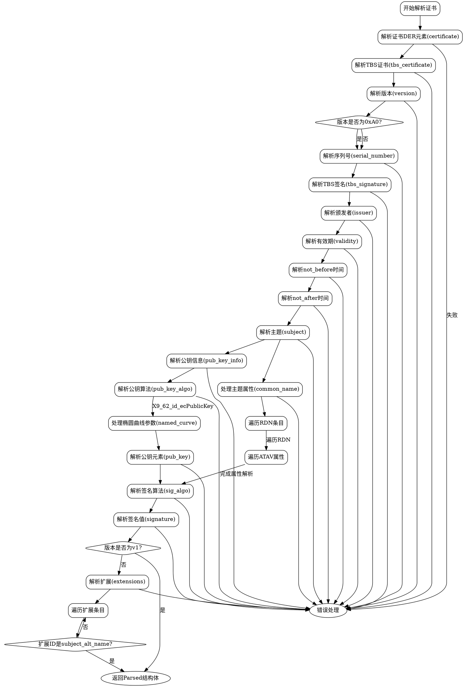

好的，我需要为给定的Zig代码生成一个流程图。首先，我需要理解代码的结构和逻辑。这个函数名为`parse`，它接受一个`Certificate`参数，并返回一个`ParseError!Parsed`类型的结果。看起来这个函数的主要目的是解析证书的各个部分，比如版本、序列号、颁发者、有效期、主题、公钥信息、签名算法等。

首先，函数开始于将证书的字节缓冲区转换为DER编码的元素。然后逐步解析不同的部分：版本、序列号、签名算法、颁发者、有效期、主题、公钥信息等。在解析过程中，可能涉及条件判断和循环，例如处理主题中的属性类型和值，以及处理扩展部分（如主题备用名称）。

接下来，我需要确定代码中的主要步骤和分支。例如，处理版本号时有一个条件判断，检查是否为版本1，这可能影响后续是否处理扩展部分。解析公钥算法时有一个switch语句，处理不同的算法类型，特别是椭圆曲线公钥的情况。此外，处理主题的循环结构需要表示为一个循环流程，可能涉及多层循环（外层循环处理RDN，内层循环处理ATAV等）。

在处理扩展部分时，代码检查版本是否为v1，如果是则跳过扩展处理。否则，继续解析扩展，查找特定的扩展ID（如主题备用名称）。这里有一个条件判断，如果扩展ID未被识别，则继续处理下一个扩展。

最后，函数返回一个包含所有解析结果的`Parsed`结构体。

为了绘制流程图，我需要将这些步骤按顺序排列，并用箭头连接。条件判断需要分支，循环需要表示重复的过程。可能需要使用不同的形状表示开始/结束、处理步骤、条件判断、循环等。

需要注意的是，代码中有多个嵌套的循环和条件判断，这可能会使流程图变得复杂。需要确保每个判断和循环都有明确的开始和结束点，避免交叉和混乱。

另外，需要注意错误处理部分，函数中使用了try关键字，可能在某些步骤中抛出错误，需要在流程图中体现可能的错误路径。

总结一下，流程图的步骤可能包括：
1. 解析证书的DER元素。
2. 解析版本号。
3. 处理序列号。
4. 解析签名算法。
5. 解析颁发者。
6. 解析有效期（包括开始和结束时间）。
7. 解析主题。
8. 解析公钥信息和算法。
9. 处理主题中的公共名称和其他属性。
10. 解析签名算法和签名值。
11. 处理扩展部分（根据版本决定是否处理）。
12. 返回解析后的结果。

对于每个主要步骤，需要确定是否有条件或循环结构，并在流程图中正确表示。
================================================

该流程图通过以下方式组织逻辑：
1. 从证书解析开始，逐步分解DER结构
2. 使用菱形节点表示条件判断（版本检查、扩展类型判断）
3. 用方框表示关键处理步骤（椭圆曲线参数处理）
4. 用嵌套的循环框表示多层属性遍历
5. 右侧的红色虚线表示错误处理路径
6. 最终返回结构化的解析结果
7. 严格遵循代码中出现的顺序：证书元数据->主体信息->签名->扩展处理