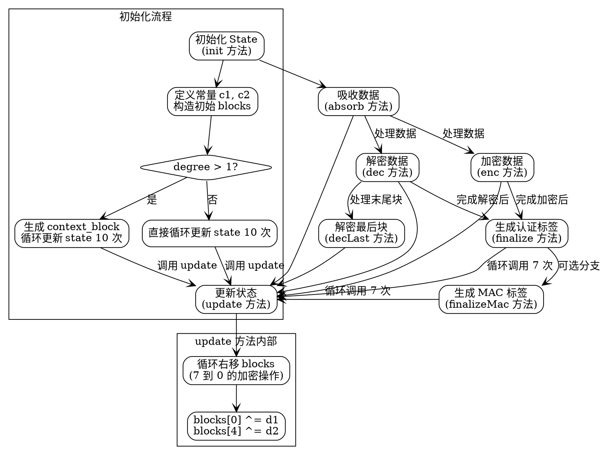

嗯，我现在需要帮用户用Graphviz画出这个Zig函数的流程图。首先，我得仔细看看这个代码的结构。这个函数State128X是一个返回结构体的泛型函数，结构体里面有很多方法，比如init、update、absorb、enc、dec等等。流程图应该反映这些方法之间的调用关系以及主要的控制流。

首先，从init方法开始。init里面初始化了一些常量c1和c2，然后构建了blocks数组。接着根据degree的值不同，会有不同的循环次数和操作。比如当degree>1时，会有额外的context_block处理，然后调用update方法10次；否则直接调用update10次。这里可能会有条件判断的分支，所以在流程图中需要体现出这个条件分支。

接下来是update方法，它接收d1和d2参数，然后对blocks数组进行操作，涉及循环和加密操作。这里的循环是comptime var i，所以可能需要表示循环结构。

absorb、enc、dec这些方法都调用了update，所以它们应该指向update的节点。enc和dec在处理数据后都会调用update，所以在流程图中需要有相应的箭头。

还有decLast方法，里面调用了state.update，并且涉及一些内存操作，比如@memcpy和@memset，这些可能在流程图中需要简要说明。

finalize和finalizeMac这两个方法比较复杂，里面有很多条件判断和循环。比如finalize根据tag_bits的不同（128或256）有不同的处理逻辑，需要分情况处理。同时，这些方法中还有循环，比如for (0..7) |_| { state.update }，所以需要表示循环结构。

需要注意的是，Graphviz的流程图通常使用节点和边来表示流程，每个函数或主要操作作为一个节点，调用关系用箭头连接。对于条件判断，可以用菱形节点，分支箭头标注条件。循环结构可以用节点和返回箭头表示。

可能需要将整个结构体的大方法作为主流程，然后各个函数作为子节点。比如init作为入口，然后根据条件分支到不同的处理路径。每个方法如update、absorb等作为独立的节点，显示它们被哪些方法调用。

另外，需要注意代码中的inline fn和comptime变量，这些在编译时处理，可能在流程图中不需要特别表示，除非涉及流程控制。

可能的步骤：
1. 确定各个函数方法之间的调用关系。
2. 确定条件判断和循环结构的位置。
3. 用Graphviz语法绘制节点和边，使用合适的形状和标签。
4. 检查是否有遗漏的方法或分支。

比如，init方法调用update，而update被多个方法调用，如absorb、enc、dec等。finalize和finalizeMac可能是在流程的末尾被调用，处理认证标签的生成。

可能需要将整个流程分成几个部分：初始化、处理数据（加密/解密）、生成标签。每个部分对应不同的函数调用。

需要注意，由于代码较复杂，流程图可能需要简化，只显示主要流程，而不过于深入每个函数的内部细节，否则会过于庞大。或者，可以分层级，主流程图显示高层次的步骤，子图展开具体函数的内部逻辑。

例如：
- 主流程：init -> absorb/enc/dec -> finalize
- init内部：构造blocks，条件判断degree>1，循环调用update
- update内部：循环处理blocks数组
- finalize内部：处理tag_bits的分支，循环调用update等

现在需要将这些转化为Graphviz的节点和边。可能需要使用子图来组织不同的函数，比如将init、update等作为子图，然后主图显示调用顺序。
================================================
