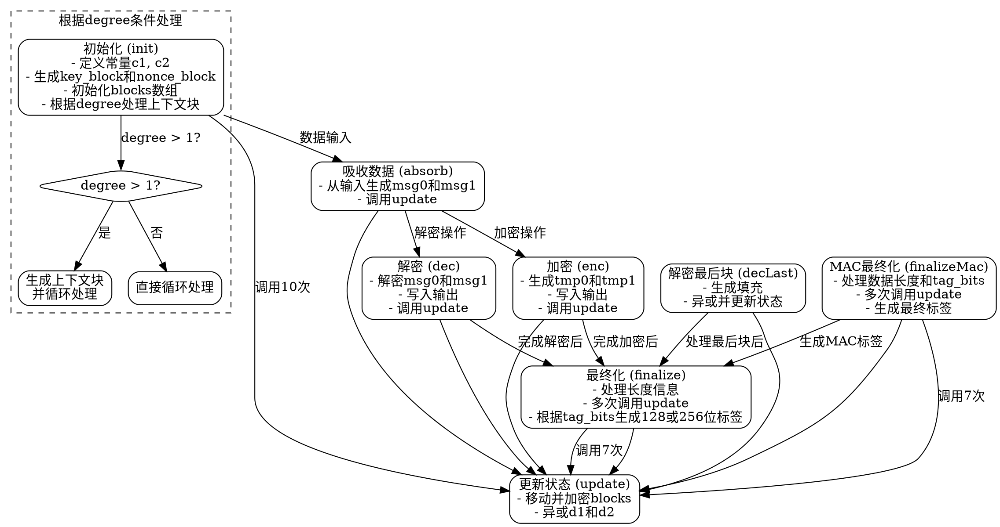

嗯，我现在需要根据提供的Zig代码为State128X函数生成一个流程图。首先，我得理解这个代码的结构和各个函数的作用。代码中定义了一个结构体State128X，包含初始化、更新、吸收、加密、解密、最终化等方法。这些方法之间可能有调用关系，需要理清它们之间的流程。

首先，结构体State128X有一个init函数，用于初始化状态。里面有一些常量和循环，尤其是当degree大于1时，会有额外的处理步骤。接下来是update函数，它被init、absorb、enc、dec等函数调用，看起来是核心的更新状态的方法。absorb处理数据输入，enc和dec处理加密和解密，finalize和finalizeMac用于生成标签。

我需要确定各个函数的调用顺序和流程。例如，初始化时init调用了update多次，而enc和dec在每次处理数据块后也会调用update。finalize在结束时处理标签生成，可能涉及多次update调用。

接下来，我需要用graphviz将这些步骤可视化。流程图应该从初始化开始，然后根据不同的操作（加密、解密、吸收数据等）分支，展示每个步骤的流程，包括条件判断（比如degree > 1的情况）和循环（比如for循环）。

可能需要将每个函数作为一个节点，用箭头表示调用关系。例如，init调用update，enc调用update，dec调用update，等等。同时，需要考虑条件分支，如degree的判断，循环结构如for循环的次数。

另外，需要注意一些细节，比如在init函数中，当degree>1时有不同的处理，这需要在流程图中体现条件判断。同样，finalize函数中有switch语句根据tag_bits的不同生成不同的标签，这也需要不同的分支。

需要确保流程图清晰展示各个函数的执行顺序和调用关系，同时正确处理循环和条件分支。可能需要将复杂的函数拆分为多个步骤，避免节点过于密集。例如，init函数中的循环可以表示为循环节点，包含循环体内的操作。

最后，要检查是否有遗漏的函数或步骤，确保流程图完整覆盖所有关键操作。
================================================
