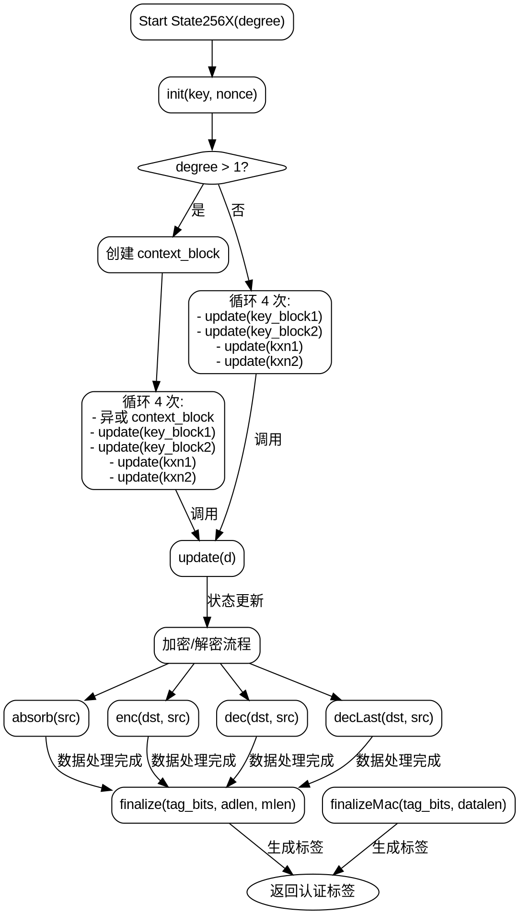

嗯，我现在需要根据提供的Zig代码中的`State256X`函数生成一个流程图。首先，我需要理解这段代码的结构和各个函数的作用。看起来这是一个AEGIS加密算法的实现，包含初始化、更新、加密、解密、最终化等步骤。

首先，`State256X`是一个返回结构体的泛型函数，接受一个`degree`参数。结构体内部有多个方法，比如`init`、`update`、`absorb`、`enc`、`dec`、`finalize`等。流程图需要涵盖这些方法的调用顺序和数据流向。

从`init`方法开始，它会初始化状态块，使用密钥和nonce生成初始的块数组。这里有一些条件判断，根据`degree`是否大于1来执行不同的初始化步骤。这可能涉及到循环处理，比如四次循环更新状态。

接下来是`update`方法，它看起来是状态转换的核心，通过加密和异或操作更新各个块。`absorb`方法用于处理输入数据，`enc`和`dec`分别处理加密和解密操作。`finalize`和`finalizeMac`用于生成最终的认证标签。

需要注意的是各个方法之间的调用关系，比如`init`中多次调用`update`，`enc`和`dec`也会调用`update`。此外，`finalize`在处理完所有数据后生成标签，可能涉及多次状态更新。

为了画出流程图，我需要分步骤：

1. **初始化流程**：从`init`开始，生成初始块，根据`degree`进行不同的处理，循环四次调用`update`。
2. **数据处理流程**：包括`absorb`、`enc`、`dec`等方法，每个方法可能调用`update`。
3. **最终化流程**：`finalize`处理长度信息，多次更新状态，生成标签。

同时需要注意条件分支，比如`degree > 1`时的额外步骤，以及在`finalize`中根据`tag_bits`的不同生成不同长度的标签。

可能的流程节点包括：
- 初始化密钥和nonce
- 生成初始块数组
- 条件判断degree
- 循环处理更新状态
- 加密/解密数据块
- 处理最后的分组数据
- 计算并返回认证标签

需要确保所有函数调用和条件分支都被正确表示在流程图中，并用箭头连接各个步骤，标明循环和条件路径。
================================================

### 流程图说明
1. **初始化**：通过`init`方法生成初始状态块，根据`degree`参数决定是否生成`context_block`并进行额外处理。
2. **循环处理**：根据`degree`的值选择不同的循环逻辑，调用`update`方法更新状态。
3. **加密/解密流程**：包含`absorb`（数据吸收）、`enc`（加密）、`dec`（解密）、`decLast`（末尾解密）等方法。
4. **最终化**：通过`finalize`或`finalizeMac`生成认证标签，根据`tag_bits`参数生成128位或256位标签。
5. **返回结果**：最终输出认证标签。

箭头表示函数调用或流程顺序，菱形节点表示条件判断。