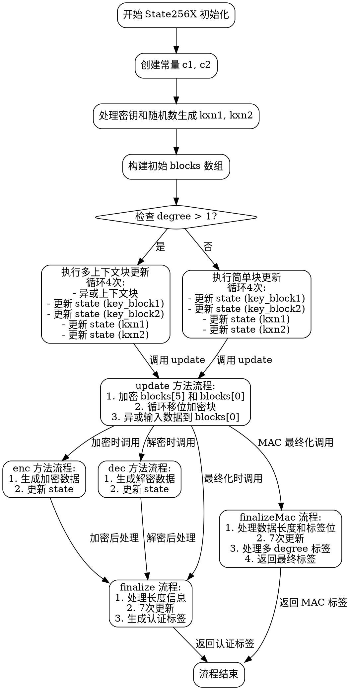

好的，我需要为这个Zig语言编写的AEGIS加密算法的State256X函数绘制一个流程图。首先，我需要理解这个函数的结构和各个部分的作用。

首先，函数State256X返回一个结构体，其中包含初始化方法init、更新方法update、加密enc、解密dec等方法。结构体内部定义了多个AES块向量（AesBlockVec），并在初始化时进行了一系列的异或操作和块更新。

接下来，我需要分解每个主要步骤：

1. **初始化（init方法）**：
   - 创建常量c1和c2。
   - 处理密钥（key）和随机数（nonce），生成kxn1和kxn2。
   - 构建初始的blocks数组。
   - 根据degree的值，执行不同的更新逻辑，可能涉及多次循环和块更新。

2. **更新状态（update方法）**：
   - 加密块并进行循环移位，最后异或输入数据。

3. **加密（enc方法）**：
   - 处理输入数据，生成加密后的输出，并更新状态。

4. **解密（dec方法）**：
   - 类似加密过程，但处理方式略有不同。

5. **最终化（finalize方法）**：
   - 处理长度信息，多次更新状态，生成认证标签。

6. **其他方法**如absorb、decLast、finalizeMac等，也需要考虑其流程。

在绘制流程图时，需要从init开始，按照初始化步骤逐步展开，然后根据不同的方法调用分支到相应的处理流程。对于循环和条件判断（如degree > 1的情况），需要正确表示循环次数和条件分支。

需要注意各个方法之间的调用关系，例如update方法在init、enc、dec等中被调用。此外，finalize和finalizeMac可能涉及不同的处理逻辑，需要分别表示。

最后，确保流程图符合graphviz的语法，使用正确的节点和箭头表示流程，避免使用mermaid语法。例如，使用digraph定义图，节点用方框表示，箭头表示流程方向，条件判断用菱形节点等。
================================================
