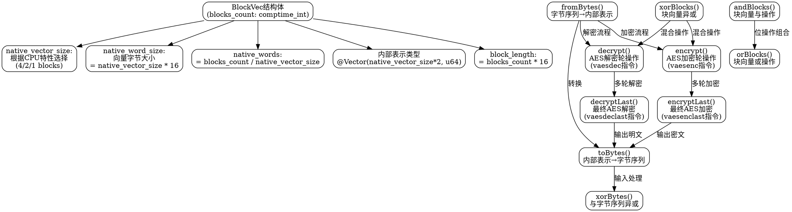

好，我需要为提供的Zig代码生成一个Graphviz的流程图。首先，我要仔细阅读代码，理解各个函数和结构的作用。

首先，这个代码定义了一个名为BlockVec的结构体，用于处理AES加密的块向量。结构体中有多个方法，如fromBytes、toBytes、xorBytes、encrypt、encryptLast、decrypt、decryptLast，以及一些位操作函数如xorBlocks、andBlocks、orBlocks。

接下来，我需要确定流程图的节点。通常，流程图会从入口开始，这里可能没有明确的入口函数，但结构体的各个方法可以视为不同的处理步骤。每个方法应该作为一个节点，并且根据它们的调用关系连接起来。

例如，当用户调用BlockVec.fromBytes时，流程进入该方法，处理字节到内部表示的转换。类似地，encrypt方法会调用底层的汇编指令vaesenc。每个方法内部可能有循环或条件判断，但根据代码，这些使用了inline for，可能在编译时展开，所以流程图中可能不需要详细展开循环，而是作为单个节点处理。

需要注意的是，结构体的方法之间存在一定的依赖关系。例如，toBytes和fromBytes是相互转换的过程，encrypt和decrypt是对称的操作。此外，xorBytes、xorBlocks等方法涉及数据处理的步骤。

在绘制流程图时，应将这些方法作为不同的节点，并用箭头表示它们之间的关系。例如，使用fromBytes将数据转换为内部表示，之后可能调用encrypt进行加密，再调用toBytes将结果转换回字节。同时，xorBytes可能用于在加密前后处理数据。

另外，结构体的静态属性如native_vector_size、native_word_size等，可能在初始化时确定，这些可以作为流程图的起始节点，显示如何根据目标架构的特性确定向量大小。

最后，需要确保使用Graphviz的正确语法，如使用digraph定义图，节点用方框表示，箭头表示流程方向。每个方法节点应标注方法名，并简要说明其功能，如“fromBytes: 转换字节到内部表示”。

可能还需要考虑错误处理或条件判断，但根据代码，没有明显的错误处理分支，因此流程可能较为线性。

总结，流程图的步骤大致如下：
1. 定义BlockVec结构体，初始化native_vector_size和native_word_size。
2. 各个转换方法（fromBytes, toBytes）作为节点。
3. 加密解密方法（encrypt, encryptLast, decrypt, decryptLast）作为处理节点。
4. 位操作（xor, and, or）作为辅助处理节点。
5. 连接这些节点，展示数据处理的流程，如从字节转换到加密再到字节输出。

需要确保每个节点之间的逻辑关系正确，并且没有遗漏重要的方法或步骤。
================================================
