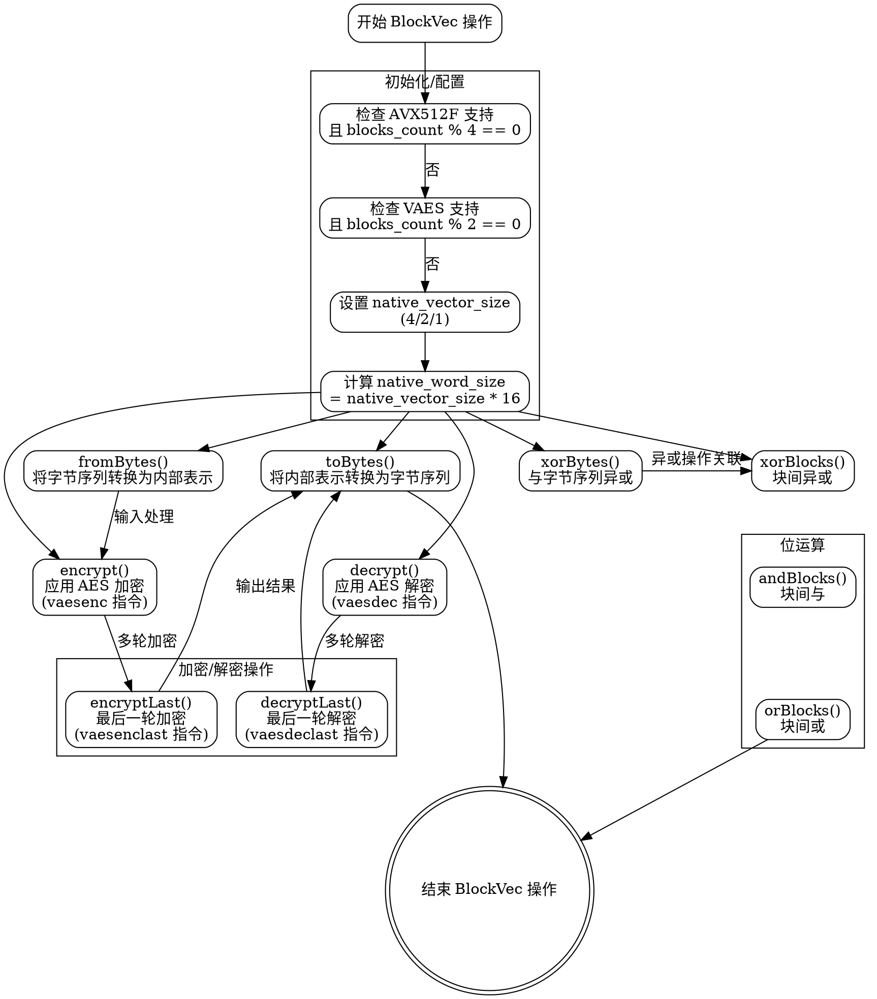

嗯，我需要为这段 Zig 代码中的 `BlockVec` 函数生成一个流程图。首先，我得理解这段代码的结构和功能。看起来这是一个用于处理 AES 加密的结构体，可能利用了硬件加速指令（比如 AES-NI）。结构体中的方法包括初始化、转换字节、异或操作，以及加密解密的各种步骤。

首先，我需要确定流程图的范围。用户提到的“函数”可能指的是整个 `BlockVec` 类型定义，包含多个方法。因此，流程图需要涵盖这个结构体的各个方法及其关系。

接下来，我需要识别各个方法之间的调用关系。例如，`fromBytes` 和 `toBytes` 用于数据转换，`encrypt`、`decrypt` 等涉及加密步骤。另外，像 `xorBytes` 这样的方法可能被其他方法调用，或者在加密流程中使用。

然后，考虑使用 Graphviz 的 DOT 语言来绘制流程图。流程图通常包括开始节点、处理步骤、条件判断、结束节点等。每个方法可以作为一个处理步骤，方法之间的调用关系用箭头连接。需要注意的是，这里的结构体方法可能并行处理多个块，但流程图应简化这些细节，突出主要逻辑。

需要注意的是，代码中有内联汇编（如 `vaesenc` 指令），这表明某些操作直接使用硬件指令，这在流程图中可能需要特别标注，以显示硬件加速的步骤。

此外，结构体中的常量如 `native_vector_size` 是根据目标架构的特性动态确定的，这可能涉及条件判断（如检查是否有 AVX512F 或 VAES 支持）。这部分逻辑应该在流程图中有所体现，比如使用条件节点来展示不同架构下的处理方式。

在组织流程图时，可以按以下步骤进行：
1. 开始节点：进入 `BlockVec` 结构体的初始化或方法调用。
2. 条件判断：确定 `native_vector_size` 的值，根据不同的 CPU 特性分支。
3. 数据转换：`fromBytes` 和 `toBytes` 的转换流程。
4. 加密/解密操作：展示 `encrypt`, `encryptLast`, `decrypt`, `decryptLast` 的步骤，可能包括循环处理每个块。
5. 位运算操作：`xorBlocks`, `andBlocks`, `orBlocks` 的处理流程。
6. 结束节点：完成所有操作，输出结果。

可能需要处理循环结构，例如在 `fromBytes` 中使用 `inline for` 循环处理多个块，这在流程图中可以表示为循环节点，或者简化为多个步骤的重复。

需要确保每个方法的输入输出清晰，并且逻辑流程连贯。同时，注意错误处理和边缘情况，但根据提供的代码，可能这部分内容较少，主要关注正常流程。

最后，将上述分析转化为 Graphviz 的 DOT 代码，使用合适的节点形状和箭头样式，确保图表清晰易懂。
================================================

这个流程图通过以下方式组织逻辑：
1. 初始化阶段根据 CPU 特性确定向量大小
2. 数据转换操作（字节与内部表示的互转）
3. 核心加密/解密操作流程
4. 位运算操作分支
5. 所有操作最终汇聚到结束节点

使用 `rank=same` 来对齐同类操作，并通过不可见边（style=invis）保持子图内部元素的排列整洁。实际执行流程会根据具体调用的方法不同而选择不同路径。