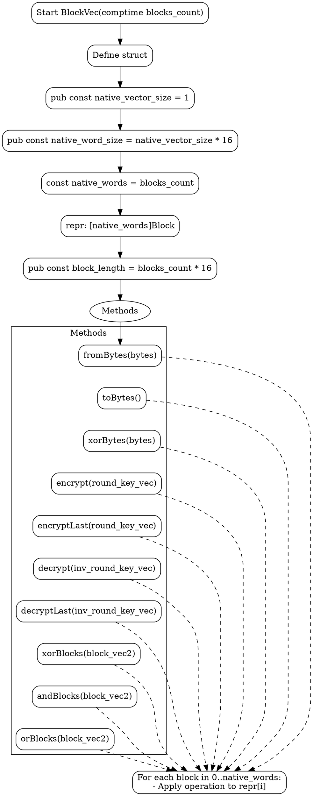

嗯，我需要为这个用Zig编写的函数生成一个流程图。首先，我要理解这个函数的代码结构。这个函数叫做BlockVec，它返回一个结构体类型，里面有很多方法，比如fromBytes、toBytes、encrypt、decrypt等等。每个方法似乎都是对内部repr数组中的每个Block进行操作，使用inline for循环来处理每个元素。

接下来，流程图应该从函数的入口开始，也就是pub fn BlockVec(...)。然后，结构体的定义部分，包括常量和内部表示。每个方法应该作为一个独立的流程节点，比如fromBytes、toBytes、xorBytes、encrypt等。每个方法的处理逻辑都是遍历native_words次，对每个Block执行相应的操作，比如转换、加密、异或等。

需要注意不要使用Mermaid语法，而是用Graphviz。所以流程图的结构应该用DOT语言来表示。节点之间的连接要显示函数的主要步骤和各个方法的调用流程。可能还需要考虑条件判断或循环结构，但在这个函数中主要是循环处理每个Block。

另外，要确保每个方法的输入输出正确连接，比如fromBytes接收字节数组，转换为BlockVec，而toBytes则相反。加密和解密方法会接受轮密钥，并进行相应的处理。异或、与、或等位操作也是类似的结构。

可能还需要处理结构体内部的常量和变量，比如native_vector_size、native_word_size、native_words等，这些应该在流程图中有所体现，但可能作为初始化或配置步骤出现。

最后，要检查是否有遗漏的方法或步骤，确保流程图完整覆盖代码中的所有函数和逻辑。
================================================
