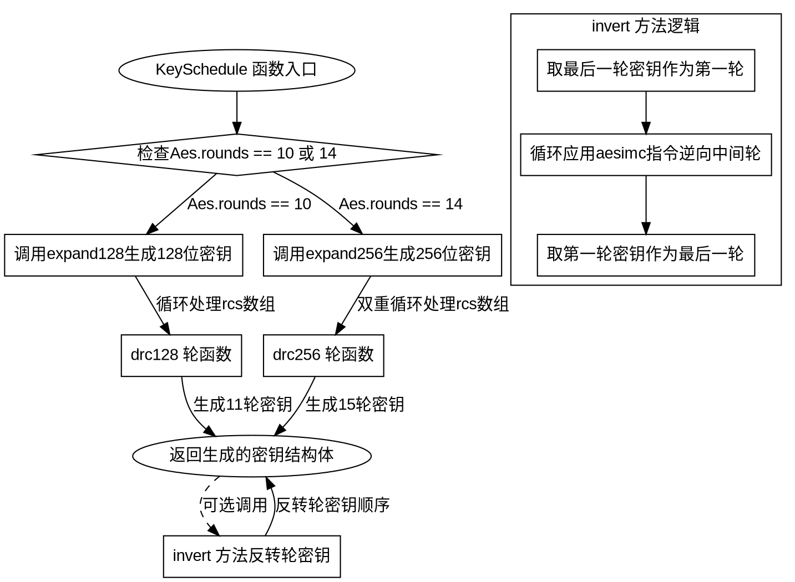

好的，我需要为给定的Zig代码中的KeySchedule函数绘制一个流程图。首先，我需要理解这段代码的结构和逻辑。

首先，函数KeySchedule是一个返回类型的函数，根据Aes.rounds的值（10或14）生成不同的结构体。结构体包含round_keys数组和一些方法，如drc128、drc256、expand128、expand256和invert。

接下来，我需要分析每个方法的作用和它们之间的调用关系。例如，expand128和expand256分别处理不同密钥长度的扩展，drc128和drc256可能是进行密钥扩展的轮函数。invert方法用于反转轮密钥的顺序，可能用于解密过程。

然后，我需要确定流程图的起点和各个分支。起点应该是KeySchedule函数被调用，根据Aes.rounds的值决定是使用expand128还是expand256。接着，生成轮密钥，最后可能有invert方法的调用。

需要注意各个函数之间的调用关系，例如expand128会调用drc128，而expand256会调用drc256。此外，invert方法会处理轮密钥的反转。

在绘制流程图时，应该使用graphviz的语法，正确表示条件判断、循环和函数调用。例如，使用菱形表示条件判断（如Aes.rounds是10还是14），矩形表示处理步骤，箭头表示流程方向。

需要确保每个步骤都正确对应代码中的逻辑，避免遗漏任何重要的分支或步骤。例如，在expand128中有一个循环处理rcs数组，而在expand256中有更复杂的循环结构，需要正确体现在流程图中。

最后，检查流程图是否涵盖了所有重要的函数和方法，包括错误处理（如std.debug.assert）以及各个辅助函数（如drc128和drc256）的调用情况。
================================================
