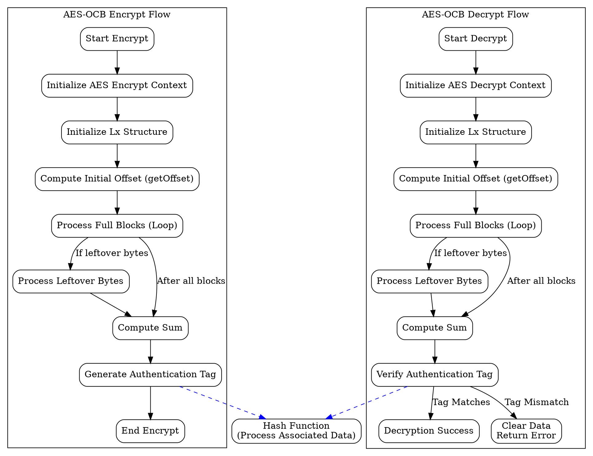

好的，我需要为给定的Zig代码中的AES-OCB实现绘制流程图。首先，我需要理解代码的结构和主要函数。

代码定义了一个名为AesOcb的结构体，包含encrypt和decrypt两个主要函数。这两个函数处理加密和解密流程，可能涉及初始化、处理块、处理剩余数据、生成标签等步骤。

首先，encrypt函数的大致流程可能是：初始化加密上下文，预处理L表，计算偏移量，处理完整的数据块，处理剩余部分，最后生成认证标签。而decrypt函数类似，但需要解密数据并验证标签。

接下来，我需要确定每个函数的关键步骤，并将其转化为流程图的节点。例如，encrypt的步骤可能包括：初始化Lx结构，获取偏移量，循环处理每个块，处理剩余字节，计算最终的tag等。

需要注意循环结构，比如while循环处理块，可能需要在流程图中用条件判断来表示。同时，错误处理部分（如解密时的认证失败）也需要在流程图中体现。

考虑到graphviz的语法，我需要为每个步骤创建节点，并用箭头连接它们表示流程顺序。例如，开始节点→初始化→处理块→处理剩余→生成tag→结束。

对于decrypt函数，流程类似，但解密步骤后需要验证tag，如果失败则清除数据并返回错误。

可能需要将encrypt和decrypt的流程图分开，或者用子图来区分。但根据用户要求，可能需要整体结构。需要确保每个函数的流程清晰，步骤不混淆。

另外，需要注意代码中的条件分支，例如处理是否还有剩余数据，或者是否使用宽块处理（wb变量）。这些条件分支需要在流程图中用菱形判断节点表示。

最后，确保所有步骤都被正确映射，没有遗漏关键部分，比如哈希计算、偏移量的更新、XOR操作等。同时，函数之间的调用关系也需要考虑，例如hash函数在生成tag时的调用。

总结，绘制流程图的步骤是：分析代码结构，识别主要函数和步骤，确定流程节点和分支，使用graphviz语法构建图表，并验证逻辑的正确性。
================================================

### 说明：
1. **加密流程（Encrypt）**：
   - 初始化AES加密上下文和Lx结构。
   - 计算初始偏移量（`getOffset`）。
   - 循环处理完整的数据块（包括并行宽块处理）。
   - 处理剩余字节（如果有）。
   - 计算总和（`sum`），生成并返回认证标签。

2. **解密流程（Decrypt）**：
   - 初始化AES解密上下文和Lx结构。
   - 类似加密流程处理数据块。
   - 验证认证标签，失败时清除数据并返回错误。

3. **共享组件**：
   - `hash`函数用于处理关联数据（虚线表示依赖关系）。

图形使用Graphviz语法，可通过工具（如VSCode的Graphviz插件）渲染为矢量图。