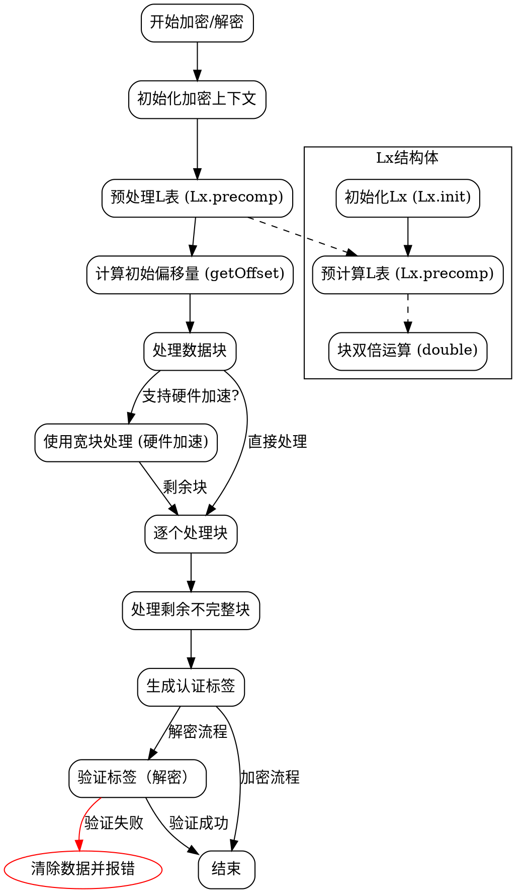

好的，我需要帮用户用Graphviz画出一个Zig函数的流程图。用户提供的代码是AES-OCB模式的加密和解密实现。首先，我需要理解这个代码的结构和主要功能，然后根据这些信息设计流程图的结构。

首先，函数AesOcb是一个泛型函数，接受一个Aes类型参数，返回一个包含加密和解密相关逻辑的结构体。结构体中有EncryptCtx和DecryptCtx，分别对应AES的加密和解密上下文。接下来，结构体中定义了key_length、nonce_length、tag_length等常量，以及Lx结构体，用于处理OCB模式中的偏移量计算和预处理。

Lx结构体中的double函数用于块的双倍运算，precomp函数预处理L表，init函数初始化Lx实例。hash函数处理关联数据的哈希。getOffset函数生成加密的初始偏移量。然后是encrypt和decrypt两个主要方法，分别处理加密和解密流程，包括处理块数据、生成认证标签等。

接下来，我需要确定如何将这些逻辑转化为流程图。流程图通常包括开始、结束节点，处理步骤，判断分支，循环等元素。由于代码中包含多个函数和循环结构，我需要将每个主要步骤分解出来，并确定它们之间的顺序和条件。

首先，流程图应从encrypt或decrypt函数开始。以encrypt函数为例，大致步骤如下：

1. 初始化加密上下文。
2. 预处理L表。
3. 计算初始偏移量。
4. 处理完整的数据块：
   a. 使用宽块处理（如果支持硬件加速）。
   b. 逐个处理剩余块。
5. 处理剩余的不完整块。
6. 生成认证标签。

每个步骤中可能包含循环和条件判断，例如处理宽块时的循环，以及处理剩余块时的循环。同样，在decrypt函数中，流程类似，但涉及到解密操作和认证校验。

对于Lx结构体的初始化、precomp方法、hash方法等内部函数，可以将其作为子流程处理，或者在主流程中简要表示。

需要注意的是，Graphviz的流程图是层次化的，需要合理安排节点和连接线，避免过于复杂。可能需要将主要步骤作为主节点，内部处理作为子节点，或者使用子图来组织代码结构。

另外，代码中的一些条件判断，例如是否支持AES-NI或ARM AES扩展，会影响处理流程（如是否使用宽块处理），这些需要在流程图中体现为条件分支。

总结下来，流程图的绘制步骤大致如下：

1. 确定主函数入口（encrypt/decrypt）。
2. 分解主函数的主要步骤。
3. 对每个步骤中的循环和条件进行建模。
4. 处理子函数调用（如Lx.init、precomp、hash等）。
5. 添加判断节点（如数据块是否完整，是否支持硬件加速等）。
6. 连接所有节点，确保流程正确。

在具体实现时，可能需要简化一些细节，例如将内部函数的具体实现合并到主流程中，或者用注释说明关键操作，以保持流程图的可读性。

最后，根据上述分析，使用Graphviz的DOT语言编写流程图代码，使用节点、边、子图等元素表示各个步骤和逻辑关系。
================================================

### 说明：
1. **主流程**：从初始化加密上下文开始，依次处理L表、偏移量、数据块，最后生成或验证标签。
2. **硬件加速分支**：根据是否支持硬件加速（如AES-NI），选择宽块处理或标准处理。
3. **解密验证**：解密时需要验证标签，失败则清除数据并报错。
4. **Lx子流程**：虚线框表示Lx结构体的内部逻辑（初始化、预计算、双倍运算）。
5. **异常处理**：红色节点表示验证失败时的错误处理流程。

使用Graphviz渲染此DOT代码，可生成包含加密/解密核心步骤的流程图。