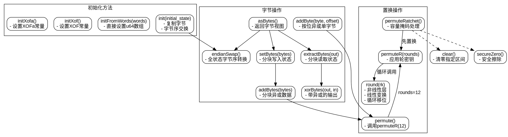

好的，我需要为这个Zig语言编写的Ascon加密算法的State函数生成一个Graphviz的流程图。首先，我得仔细阅读代码，理解各个函数的作用和它们之间的调用关系。

首先，State函数是一个泛型函数，接受一个endian参数，返回一个结构体。结构体内部定义了多个方法，比如初始化状态、字节操作、置换（permutation）等。我需要确定每个方法的执行流程以及它们之间的逻辑顺序。

接下来，我会从init方法开始，它通过复制初始状态并进行字节序交换来初始化状态。然后是initFromWords和initXof、initXofA这些不同的初始化方法，它们各自设置特定的初始值。

然后是一些操作字节的方法，如asBytes、endianSwap、setBytes、addByte、addBytes、extractBytes、xorBytes等。这些方法主要处理状态的字节表示和转换。

置换相关的函数有permuteR、permute、permuteRatchet和round。permuteR应用指定轮数的置换，permute则是固定12轮。permuteRatchet在置换后处理容量部分。round函数是核心置换逻辑，包含异或、位操作和循环移位。

现在需要考虑如何将这些方法组织成流程图。可能需要将初始化、字节操作、置换等作为主要模块，显示它们之间的调用关系。比如，init可能会调用endianSwap，permuteR调用round等。

还要注意条件判断和循环结构，比如在setBytes和addBytes中的循环处理不完整的字节块。这些在流程图中需要用判断框和循环框表示。

另外，round函数中的复杂位操作可能需要简化表示，避免流程图过于复杂。可以将其概括为几个步骤，如异或、线性层、循环移位等。

最后，需要确保流程图符合Graphviz的语法，使用正确的节点和箭头，合理布局，使得整个结构清晰易懂。可能需要将主要方法作为子图，展示它们之间的关系和数据流向。
================================================
