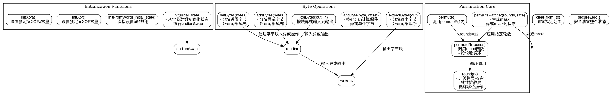

嗯，我需要帮用户用Graphviz画出这个Zig函数的流程图。首先，我得先理解这个代码的结构和各个函数的作用。这个文件定义了一个名为`State`的结构体，包含多个方法，比如初始化、字节操作、排列（permutation）等。

首先，我应该确定需要绘制流程图的函数范围。用户提到的是整个`State`结构体的函数，所以可能需要为每个方法绘制流程，或者只针对主要的公共方法。比如，`init`、`permute`、`permuteR`等可能是关键部分。

接下来，我需要分析每个函数的结构。例如，`init`函数初始化状态，`permuteR`应用减少轮数的排列，而`round`是核心的排列步骤。每个函数内部的条件、循环和调用关系需要被识别出来，以构建流程图的结构。

然后，考虑如何将这些函数和它们的逻辑关系用Graphviz的节点和边表示。可能需要为每个函数创建一个子图，或者将主要的控制流连接起来。比如，`permuteR`调用`round`多次，这可以用循环结构表示。

另外，需要注意条件语句，比如在`setBytes`和`extractBytes`中的循环处理完整的8字节块和剩余字节的部分，这可能需要分支节点。

可能遇到的挑战是如何简洁地表示复杂的位操作和循环逻辑，同时保持流程图的可读性。可能需要简化某些步骤，例如将多个位操作合并为一个节点，或者用注释节点说明复杂的运算。

最后，需要确保流程图的正确性，准确反映代码的执行流程。可能需要多次检查每个函数的逻辑，确保节点和边的连接正确无误。
================================================


该流程图特点：
1. 使用子图分组展示初始化/字节操作/核心排列三类主要功能
2. 用虚线箭头表示隐藏的底层操作（如endianSwap）
3. 对关键算法模块（如round函数）标注核心操作步骤
4. 使用注释节点说明复杂位操作的实际含义
5. 通过连接方向展示函数调用层级关系
6. 隐藏了底层位运算细节，聚焦控制流和关键数据流

可通过Graphviz渲染工具（如VSCode插件）生成矢量图，建议添加以下样式：
```dot
graph [bgcolor="transparent"];
node [color="#2D3436", fontcolor="#2D3436"];
edge [color="#636E72"];
``` 
以获得更好的可视化效果。