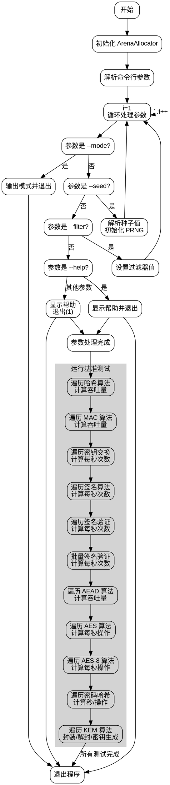

嗯，用户让我用Graphviz来画一个Zig函数的流程图，但不要用Mermaid。首先，我需要理解这个Zig代码的结构。这个main函数看起来是一个基准测试工具，处理不同的命令行参数，然后根据参数过滤条件运行各种加密算法的性能测试。

首先，函数开始处处理命令行参数。比如有--mode、--seed、--filter、--help等选项。接着，根据是否有filter参数，决定是否运行对应的基准测试。每个基准测试部分（如hashes、macs、exchanges等）都循环遍历对应的算法，并调用相应的benchmark函数，最后输出结果。

我需要把这个流程拆解成步骤，然后用Graphviz的节点和边来表示。可能的节点包括初始化、参数解析、各个条件判断（如处理--mode、--seed等）、以及各个基准测试的循环部分。边表示流程的顺序和条件分支。

需要注意的是，函数中有多个inline for循环，每个循环对应不同类型的测试（hashes、macs等）。每个循环内部都有一个条件判断是否执行测试，这可能需要用条件节点来表示。同时，处理命令行参数的部分有多个if-else分支，需要正确表示这些分支的逻辑。

可能的结构是：开始节点 -> 初始化（ArenaAllocator等）-> 解析参数 -> 处理每个参数（循环）-> 根据参数执行不同操作（如设置filter、seed等）-> 执行各个基准测试部分 -> 结束。

需要注意循环和条件分支的正确表示，比如while循环处理参数，每个参数可能的选项，以及各个inline for循环的执行条件。可能需要为每个基准测试类型（如hashes、macs）创建子图，或者用不同的节点表示。

此外，错误处理和退出点（如参数错误时调用usage()并exit）也需要在流程图中体现。

最后，确保使用Graphviz的语法，正确使用节点、边、条件判断、循环等结构，避免使用Mermaid特有的语法。
================================================


这个流程图使用Graphviz的DOT语言表示，主要特点：

1. 用菱形节点表示参数判断分支
2. 用矩形节点表示操作步骤
3. 用灰色区域包裹所有基准测试模块
4. 箭头上的文字说明判断条件
5. 保持与原始代码相同的执行顺序：
   - 参数解析循环
   - 按顺序执行哈希/MAC/密钥交换等测试
   - 最终退出程序

可以通过Graphviz工具（如dot命令）渲染为PNG/SVG等格式：
```bash
dot -Tpng flowchart.dot -o flowchart.png
```