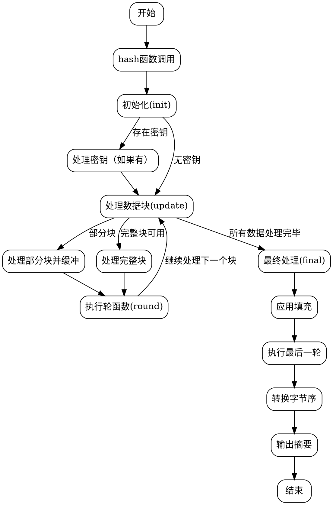

好的，我需要为给定的Zig语言实现的BLAKE2b哈希函数生成流程图。首先，我需要理解代码的结构和各个函数的作用。

首先，这个Blake2b函数是一个泛型结构体，接受一个输出位数参数out_bits。它包含了初始化（init）、更新（update）、最终处理（final）以及哈希计算（hash）等方法。还有内部使用的round函数用于处理每一轮的计算。

接下来，我需要确定流程图中需要包含的主要部分。通常，流程图会涵盖函数调用顺序、数据处理流程以及循环和条件判断。对于哈希函数来说，常见的流程是初始化、处理数据块、更新内部状态、处理填充块，最后生成摘要。

首先，init函数初始化状态，处理密钥、盐和上下文。然后，update函数处理输入数据，可能分块处理，并调用round函数进行每一轮的计算。final函数处理最后一个数据块，应用可能的填充，并生成最终的哈希值。hash函数则是整个过程的封装，依次调用init、update和final。

在画流程图时，需要注意各个函数之间的调用关系和数据流动。例如，hash函数调用init、update和final。update函数可能会多次调用round来处理每个数据块，而final在最后一次调用round时设置标志位。此外，round函数内部有复杂的轮函数处理，涉及多个步骤，可能需要进一步分解。

可能的步骤如下：
1. 开始于hash函数，调用init进行初始化。
2. 将输入数据传递给update函数，处理每个128字节的块，调用round进行处理。
3. 处理完所有数据块后，调用final函数处理最后一个块，应用填充，并执行最后一轮计算。
4. 最终将内部状态转换为小端字节序，输出摘要。

需要注意处理密钥的情况，当存在密钥时，init函数会进行额外的处理，并在update中处理密钥数据。此外，salt和上下文参数也会影响初始状态。

在绘制流程图时，每个函数作为一个节点，箭头表示调用顺序和数据流动。循环和条件判断（如是否有密钥、是否处理最后一个块）需要用分支节点表示。

由于代码中使用了comptime参数和内联循环，可能需要在流程图中简化这些编译时行为，专注于运行时流程。

最后，确保流程图的每个步骤清晰，正确反映代码的执行路径，特别是round函数的内部处理和各轮的sigma排列使用。
================================================

该流程图展示了以下关键路径：
1. **初始化阶段**：处理密钥/盐/上下文参数，初始化状态变量
2. **数据更新阶段**：
   - 处理完整的数据块（128字节）
   - 处理部分数据块并缓存
   - 循环调用轮函数处理每个块
3. **最终处理阶段**：
   - 应用填充规则
   - 执行最后一轮特殊处理
   - 转换字节序并输出最终摘要

每个灰色菱形表示条件判断（如是否存在密钥、是否完整块等），圆角矩形表示具体的处理步骤，箭头方向表示程序执行流程。轮函数内部复杂的sigma排列和位操作在流程图中被简化为单个处理节点。