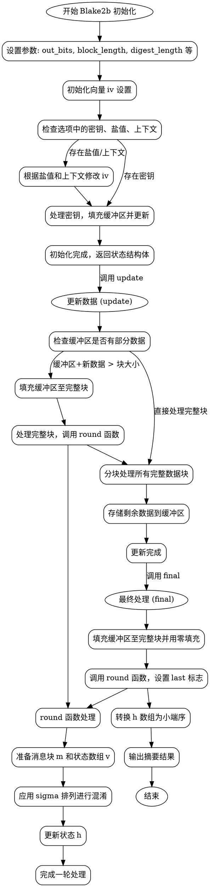

嗯，我现在需要为这个用Zig编写的Blake2b函数绘制一个流程图。首先，我得理解这段代码的结构和逻辑，这样才能正确地画出流程。

首先，函数Blake2b是一个返回类型的函数，它根据给定的输出位数生成一个结构体。这个结构体包含了各种常量和变量，比如块长度、摘要长度、初始化向量(iv)、sigma矩阵等。接下来是初始化函数init，更新函数update，和最终处理函数final，以及内部的round函数。

流程图应该从Blake2b的入口开始，也就是调用init函数初始化状态。然后，当有数据输入时，update函数会被调用来处理数据块。每次处理数据块时，可能需要处理缓冲区中的部分数据，或者直接处理完整的数据块。最后，调用final函数完成计算并生成最终的摘要。

需要注意的是，在处理数据时，如果缓冲区已经有部分数据，会先将新数据填充到缓冲区，然后进行压缩（round函数）。如果数据足够多，会分块处理，每次处理128字节。最后的块可能需要填充，并且在最后一轮处理时设置特定的标志（last参数为true）。

在round函数内部，会进行多轮的混合操作，使用sigma矩阵中的排列来打乱数据。每一轮有多个步骤，涉及不同的变量和操作，比如加法、异或、循环右移等。这些步骤需要正确地在流程图中表示出来。

另外，初始化时需要考虑密钥、盐值、上下文等参数的影响，这些参数会修改初始向量(iv)中的某些部分。如果提供了密钥，还需要在初始化后立即更新内部状态。

在绘制流程图时，需要将各个函数之间的调用关系和数据流动清晰地表示出来。例如，init初始化状态，update处理数据并可能多次调用round，final处理最后的块并生成结果。每个步骤的条件判断，比如缓冲区是否已满，是否需要处理中间块等，也需要在流程图中体现。

可能需要注意的细节包括：缓冲区的管理（buf和buf_len的处理），t变量记录已处理的数据量，以及在final时如何将h数组转换为小端序输出。此外，round函数中的循环和条件判断（如last参数影响v[14]的值）也是关键点。

总结一下，流程图的大致步骤可能是：

1. 开始于Blake2b结构的初始化（init函数）。
2. 处理密钥、盐值、上下文参数，调整初始向量。
3. 如果有密钥，填充缓冲区并更新状态。
4. 进入数据处理的循环（update函数）：
   a. 处理缓冲区中的剩余数据和新输入的数据。
   b. 分块处理完整的数据块，调用round函数。
   c. 将剩余数据存入缓冲区。
5. 最终处理（final函数）：
   a. 填充缓冲区至完整块。
   b. 最后一次调用round函数，设置last标志。
   c. 将状态数组转换为小端序并输出摘要。
6. round函数内部的多轮混合操作，使用sigma矩阵进行数据混淆。

现在需要将这些步骤转化为Graphviz的节点和边，注意条件判断和循环结构，以及函数之间的调用关系。可能需要使用不同的节点形状来表示开始、结束、处理步骤、条件判断等。
================================================
