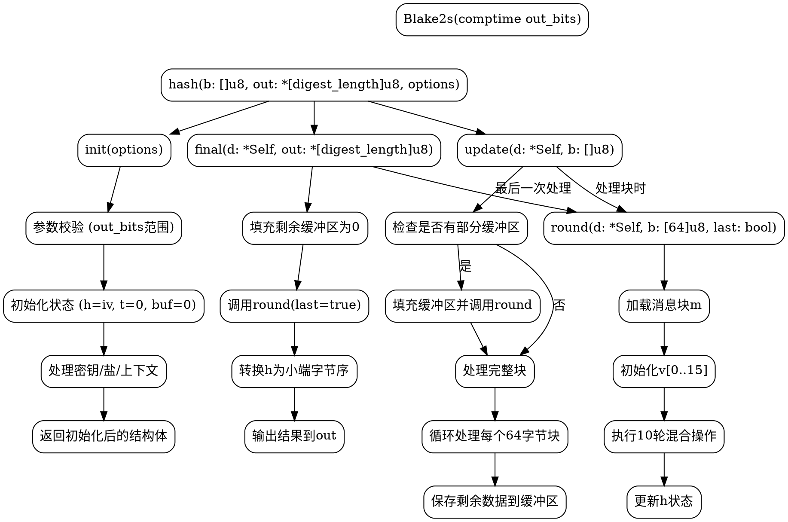

好的，我现在需要帮用户用Graphviz画出他们提供的Zig代码中Blake2s函数的流程图。首先，我得仔细看一下代码的结构和主要功能。

这个Blake2s函数是一个泛型结构，根据输出的位数生成不同的类型。结构体包含初始化（init）、更新（update）、最终处理（final）等方法，还有内部使用的轮函数（round）。流程图应该覆盖这些主要方法以及它们之间的调用关系。

首先，从init方法开始，它初始化了h、t、buf等状态变量。然后用户调用update方法来逐步输入数据进行处理，最后调用final生成摘要。每个update可能会处理一个块（64字节），如果数据不足一个块，会暂存在buf中，等到下次update或者final时处理。final方法处理剩余的数据，并执行最后的轮运算，生成最终的哈希值。

接下来需要考虑各个函数之间的流程。例如，init会被hash函数调用，hash函数又会调用update和final。update可能多次调用round来处理完整的数据块，而final在最后一次调用round时会设置标志位last为true。round函数内部使用了sigma数组和一系列的位运算，这部分可能在流程图中需要简化，避免过于复杂。

可能的结构是：
1. 主函数Blake2s，包含各个子函数。
2. init的流程：参数检查，初始化状态，处理密钥、盐、上下文等。
3. update的流程：处理输入数据，分为填满缓冲区、处理完整块、保存剩余部分到缓冲区。
4. final的流程：填充剩余数据，执行最后的轮运算，转换字节序，输出结果。
5. round函数的详细步骤，包括消息扩展、变量初始化、多轮运算、更新哈希状态。

不过，考虑到Graphviz的流程图不宜过于复杂，可能需要将高层次的方法调用和关键步骤展示出来，而内部复杂的运算步骤可以简化为一个处理块。例如，round函数内部的循环和位操作可以简化为一个“执行轮运算”的步骤，而不需要展开每一轮的具体操作。

另外，需要注意错误处理和可选参数的处理，比如密钥、盐和上下文是否存在。在init中，这些可选参数会影响状态的初始化，这应该在流程图中有所体现。

最后，考虑到用户可能希望流程图清晰易懂，可能需要将主要方法作为节点，用箭头表示调用顺序和数据流向。例如，hash方法调用init、update、final；update可能多次调用round；final调用round并处理最终结果。

可能的结构如下：
- Blake2s结构体
  - init
    - 处理参数
    - 初始化状态
    - 处理密钥、盐、上下文
  - update
    - 处理缓冲区
    - 处理完整块
    - 保存剩余到缓冲区
  - final
    - 填充数据
    - 最后一次round调用
    - 转换字节序
    - 输出结果
  - round
    - 消息扩展
    - 初始化变量v
    - 执行10轮运算
    - 更新哈希状态

在绘制流程图时，每个函数作为一个节点，函数内的关键步骤作为子节点，箭头表示流程顺序。对于循环结构，如update中的处理完整块，可以用循环节点表示。

现在需要将这些步骤转化为Graphviz的dot语法，注意节点和边的连接关系，确保逻辑清晰。
================================================
