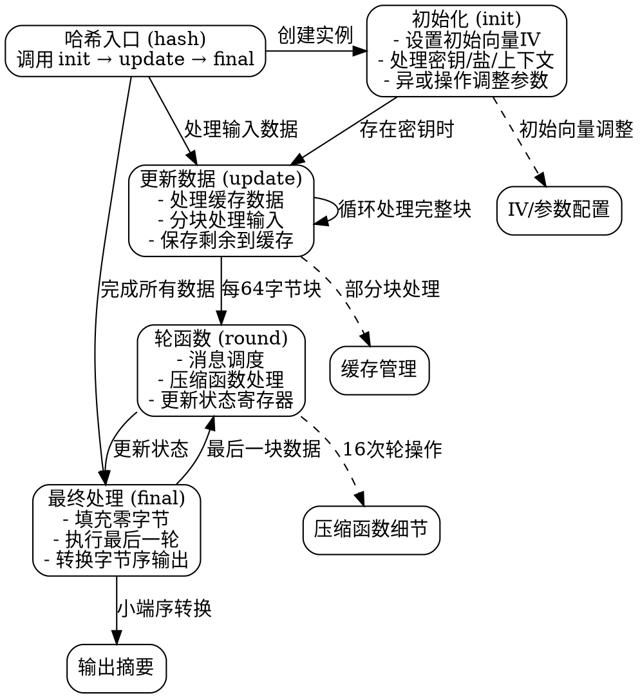

好的，我现在需要帮用户生成一个Blake2s Zig函数的流程图，使用Graphviz。首先，我得仔细看一下提供的代码，理解它的结构和各个函数的作用。

首先，Blake2s是一个哈希函数的结构体，包含init、update、final等方法。我需要确定这些主要函数的执行流程，以及它们之间的调用关系。

从代码中可以看到：

1. **init函数**：初始化结构体，设置初始向量（IV），处理密钥、盐和上下文参数，并进行一些异或操作。如果有密钥，还会调用update方法。

2. **update函数**：处理输入数据，分块处理。如果有缓存的数据，先处理缓存，然后处理完整的数据块，最后将剩余部分存入缓存。

3. **final函数**：处理最后的数据块，填充零，执行最后一轮计算，并将结果转换为小端序，输出摘要。

4. **round函数**：执行具体的压缩函数，包括消息调度和轮函数处理。

接下来，我需要将这些步骤转化为流程图。每个函数作为节点，箭头表示调用顺序或数据流向。比如，hash函数会调用init、update、final。update可能多次调用round，final调用round一次，并处理最后的输出。

需要注意的是，Graphviz的语法是用节点和边来表示流程。例如：

digraph G {
    init -> update;
    update -> round [label="处理数据块"];
    update -> update [label="剩余数据"];
    update -> final;
    final -> round [label="最后一块"];
    final -> 输出摘要;
}

另外，错误处理和缓存管理可能需要特别标注。比如，在update中，如果有部分缓存，先处理这部分，再处理新的数据块。循环处理完整块，剩余数据存入缓存。

可能还需要考虑条件分支，比如是否有密钥、盐或上下文参数，这些会影响init的执行路径。但为了简化流程图，可能将这些条件作为节点的注释，而不是单独的分支节点。

总结步骤：

1. 确定主要函数节点：init, update, final, round。
2. 确定函数间的调用关系。
3. 标注条件判断和循环过程。
4. 使用Graphviz语法绘制流程图，确保节点和边正确连接。

需要注意，不要遗漏关键步骤，比如init中的密钥处理，update中的缓存管理，final中的填充和最后一轮计算。此外，确保流程图的逻辑清晰，易于理解。
================================================
