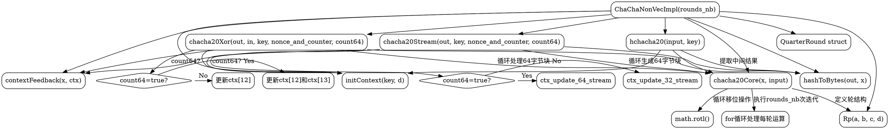

好的，我需要帮用户用Graphviz画出这个Zig语言实现的ChaCha20函数的流程图。首先，我需要仔细阅读代码，理解各个函数的功能和它们之间的调用关系。

首先，这个文件定义了一个名为`ChaChaNonVecImpl`的函数，它返回一个结构体类型。结构体内部包含了多个函数，比如`initContext`、`chacha20Core`、`hashToBytes`、`chacha20Xor`、`chacha20Stream`和`hchacha20`。我需要理清这些函数之间的调用流程。

从代码结构来看，`initContext`用于初始化上下文，生成初始的BlockVec。`chacha20Core`是核心处理函数，执行轮运算。`hashToBytes`将处理后的数据转换为字节。`contextFeedback`将上下文反馈到当前状态。`chacha20Xor`和`chacha20Stream`是主要的加密函数，前者处理异或加密，后者生成密钥流。`hchacha20`是另一个函数，可能用于生成HChaCha20的摘要。

接下来，我需要确定每个函数的调用路径。例如，`chacha20Xor`调用了`initContext`、`chacha20Core`、`contextFeedback`、`hashToBytes`，而`hchacha20`也调用了`initContext`和`chacha20Core`。同时，`chacha20Core`内部有循环和轮函数处理。

对于流程图，每个函数应该作为一个节点，函数之间的调用关系用箭头连接。需要注意循环和条件分支，比如在`chacha20Xor`中的循环处理数据块，以及根据`count64`的不同处理计数器的方式。

需要注意的是，Graphviz使用DOT语言，节点需要定义，然后用边连接。可能需要将每个主要函数作为节点，并展示它们之间的调用流程。例如：

- `chacha20Xor`调用`initContext`，然后进入循环，调用`chacha20Core` -> `contextFeedback` -> `hashToBytes`，之后处理异或操作，并根据条件更新计数器。
- `hchacha20`同样调用`initContext`和`chacha20Core`，然后输出结果。

另外，结构体的内部函数可能需要作为子图处理，但为了简化，可能直接作为独立节点。

需要确保流程图的层次结构清晰，调用顺序正确，循环和条件分支适当标注。例如，循环处理数据块的部分可以用节点内的注释或标签表示。

最后，生成DOT代码时，要注意节点命名唯一，箭头方向正确，避免交叉和混乱。
================================================

这个流程图使用以下约定：
1. 主结构体`ChaChaNonVecImpl`作为根节点
2. 菱形节点表示条件分支（如count64判断）
3. 核心加密函数`chacha20Core`包含轮函数细节
4. 虚线框表示隐式调用的底层操作（如数学运算）
5. 带标签的箭头明确调用关系和条件分支
6. 使用rank=same保持相关节点对齐
7. 循环操作在调用箭头直接用标签说明

可以通过Graphviz工具（如dot命令或在线编辑器）渲染生成矢量图。如果需要更详细的实现细节（如quarter round展开），可以进一步扩展`chacha20Core`的子结构。