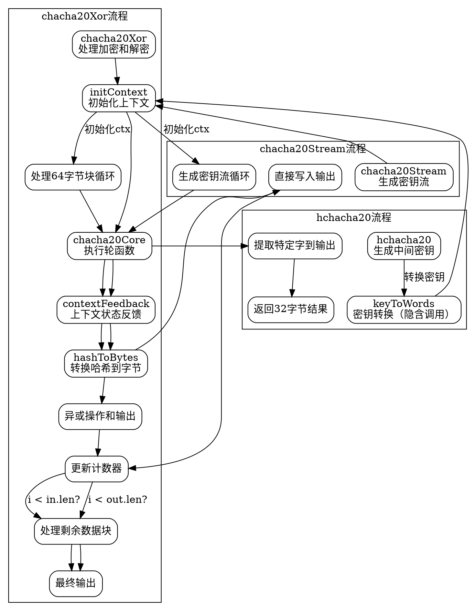

嗯，我现在需要为这个用Zig编写的ChaCha20函数画一个流程图。首先，我得仔细看看代码的结构，理解各个函数的作用和它们之间的调用关系。这个代码定义了一个名为ChaChaNonVecImpl的结构体，它包含多个函数，比如initContext、chacha20Core、hashToBytes、chacha20Xor等等。流程图需要展示这些函数如何相互调用，以及整个加密过程的数据流。

首先，我会从入口函数开始分析。看起来chacha20Xor和chacha20Stream可能是主要的入口点，因为它们处理加密和生成密钥流。hchacha20可能用于生成中间密钥。每个函数内部调用了其他函数，比如initContext来初始化上下文，chacha20Core执行核心的ChaCha轮函数，hashToBytes将结果转换为字节，contextFeedback用于反馈更新状态。

接下来，我需要确定各个函数之间的调用关系。例如，chacha20Xor会调用initContext来创建初始的上下文，然后循环调用chacha20Core生成每个块，接着用contextFeedback和hashToBytes处理数据，最后进行异或操作。同时，计数器在每次循环后递增，处理可能的分块情况。类似地，chacha20Stream生成密钥流，hchacha20则可能用于密钥扩展。

绘制流程图时，应该将每个主要函数作为一个节点，用箭头表示调用顺序和数据流向。例如，chacha20Xor调用initContext，然后进入循环，调用chacha20Core、contextFeedback、hashToBytes，处理数据块，更新计数器等。需要注意的是条件判断，比如是否处理最后一个块，以及count64参数对计数器更新的影响。

可能还需要注意错误处理或边界情况，比如输入数据不是64字节的倍数时的处理。不过代码中已经处理了这种情况，在循环结束后处理剩余的数据。

总结下来，流程图的步骤可能如下：

1. 入口函数（chacha20Xor或chacha20Stream）开始。
2. 初始化上下文（initContext）。
3. 进入循环，处理每个64字节块：
   a. 执行核心轮函数（chacha20Core）。
   b. 应用上下文反馈（contextFeedback）。
   c. 将结果转换为字节（hashToBytes）。
   d. 对输入数据进行异或操作（仅限chacha20Xor）。
   e. 更新计数器。
4. 处理剩余的数据块（如果存在）。
5. 输出结果。

对于hchacha20函数，流程可能不同，因为它处理不同的输入并生成32字节的输出，可能涉及不同的步骤，比如转换输入密钥，调用核心轮函数，然后提取特定的字到输出中。

现在需要将这些步骤转化为Graphviz的节点和边，使用合适的形状和标签。函数调用用矩形框，条件判断用菱形，循环用箭头连接，标注每个步骤的关键操作。可能需要将主要函数作为子图，显示它们之间的调用关系。

需要注意的是，Graphviz的语法需要正确嵌套，子图可能需要适当的结构。例如，主函数调用initContext，然后在循环中调用其他函数。每个循环中的步骤可以表示为顺序节点，并可能包含条件判断来处理计数器更新方式（count64是否为真）。

最后，确保所有函数和关键步骤都被包含在流程图中，数据流和函数调用关系清晰可辨。
================================================

### 流程图说明：
1. **顶层函数**：
   - `chacha20Xor`：处理加密/解密（带异或操作）
   - `chacha20Stream`：生成原始密钥流
   - `hchacha20`：用于密钥派生（如XChaCha20的中间步骤）

2. **共享组件**：
   - `initContext`：初始化包含常量、密钥、nonce的上下文
   - `chacha20Core`：执行核心的20轮置换
   - `hashToBytes`：将32位字转换为字节流
   - `contextFeedback`：将初始上下文状态反馈到结果中

3. **关键流程**：
   - **加密流程**：
     - 初始化上下文后循环处理64字节块
     - 每块经过轮函数→状态反馈→字节转换→异或操作
     - 处理剩余字节并更新计数器（支持32/64位计数器）
   - **密钥派生流程**：
     - 通过截取轮函数结果的前4字和后4字生成32字节输出

4. **特殊逻辑**：
   - 用 `@addWithOverflow` 处理64位计数器溢出
   - 通过 `count64` 参数控制计数器宽度
   - 使用Zig的 `comptime` 特性实现编译时循环展开

该图通过子图分离不同功能的流程，同时保持共享函数的复用性，箭头方向表示数据流动和函数调用顺序。