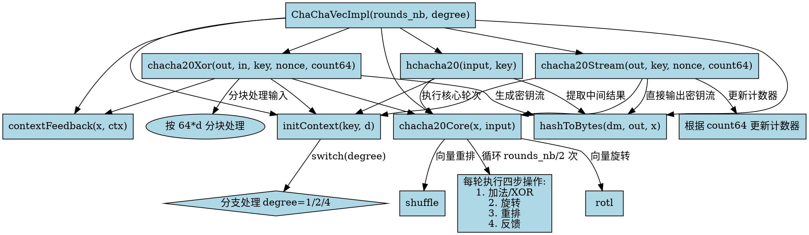

好的，我需要为提供的Zig代码中的`ChaChaVecImpl`函数绘制流程图。首先，我得仔细理解代码的结构和各个部分的功能。

首先，这个函数是一个泛型函数，接受`rounds_nb`和`degree`作为编译时参数，返回一个结构体类型。结构体内部包含多个方法，如`initContext`、`chacha20Core`、`hashToBytes`、`contextFeedback`、`chacha20Xor`、`chacha20Stream`和`hchacha20`。

流程图需要展示这些方法之间的调用关系以及主要的逻辑流程。例如，`chacha20Xor`和`chacha20Stream`都调用了`initContext`、`chacha20Core`和`contextFeedback`，而`hchacha20`也调用了`initContext`和`chacha20Core`。此外，`initContext`根据不同的`degree`有不同的实现分支。

接下来，我需要确定各个模块的输入输出以及它们之间的数据流向。例如，`initContext`生成初始的上下文块，然后被其他函数使用。`chacha20Core`执行核心的加密轮次，可能涉及多个循环和向量操作。

需要注意条件分支，比如`switch (degree)`的不同情况，还有循环结构如`while`和`for`循环。这些在流程图中需要用条件判断和循环节点来表示。

另外，函数中使用了内联函数（`inline fn`），这可能影响流程图的细节，但为了简化，可以将其视为普通函数处理。

最后，确保流程图符合Graphviz的语法，正确使用节点、边、子图等元素，清晰地展示函数的结构和逻辑流程。
================================================
