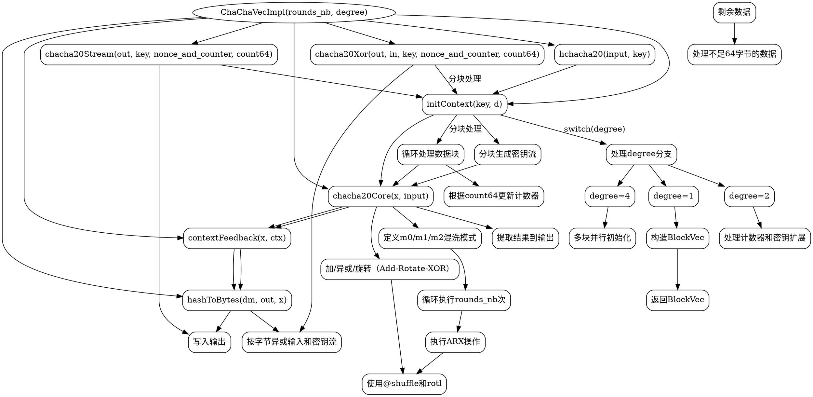

嗯，我需要帮用户用Graphviz画出这个Zig函数ChaChaVecImpl的流程图。首先，我得理解这个函数的结构和逻辑。看起来这是一个实现ChaCha20算法的函数，支持不同的并行度（degree），比如1、2、4。函数返回一个结构体类型，里面包含初始化上下文、核心处理、哈希转字节、上下文反馈、加密流等方法。

首先，我应该确定这个结构体的主要组成部分，比如initContext、chacha20Core、hashToBytes、contextFeedback、chacha20Xor、chacha20Stream、hchacha20。每个方法之间的关系和流程需要梳理清楚。

然后，流程图需要展示各个函数的调用顺序和数据流动。例如，chacha20Xor调用initContext初始化上下文，然后循环处理数据块，每次调用chacha20Core和contextFeedback，接着用hashToBytes生成密钥流，最后进行异或操作。同时，处理完每个块后，会更新计数器。

可能会遇到的问题是，如何处理不同degree的分支，比如在initContext中的switch语句，不同的degree有不同的处理逻辑。流程图是否需要详细展示每个分支？或者可以简化为一个判断框，然后指向不同的处理流程？

另外，循环结构在流程图中需要用循环节点表示，比如处理数据块的while循环。还需要考虑条件判断，比如根据剩余数据长度决定是否进入最后一个块的处理。

对于hchacha20函数，它调用initContext和chacha20Core，然后提取部分结果生成输出。这部分也需要在流程图中体现。

可能需要将整个结构体作为一个主模块，各个函数作为子模块，然后用箭头表示调用关系和数据流向。同时，注意不同函数的输入输出参数，比如密钥、nonce、输入数据等。

需要确保流程图的层次结构清晰，主流程如加密和解密过程分开，或者根据函数调用顺序排列。可能需要使用子图来分组不同的功能模块。

最后，根据Graphviz的语法，使用节点和边来表示各个步骤，用条件判断和循环结构来连接节点。可能需要使用不同的形状，如矩形表示处理步骤，菱形表示判断，箭头表示流程方向。
================================================

这个流程图展示了以下关键点：
1. 主结构`ChaChaVecImpl`包含的所有核心函数
2. 初始化上下文中对不同并行度(degree)的分支处理
3. 核心加密轮函数`chacha20Core`的ARX操作流程
4. 加密流生成和异或操作的分块处理逻辑
5. HChaCha20的简化处理流程
6. 通用操作（如计数器更新、尾部数据处理）的独立表示

使用Graphviz渲染时，建议通过`dot -Tsvg chacha20.dot -o chacha20.svg`生成矢量图以获得最佳可读性。