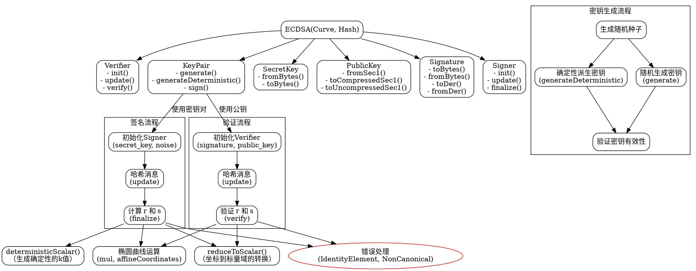

好的，我现在需要为提供的Zig代码中的Ecdsa函数绘制流程图。首先，我需要理解这段代码的结构和功能。

首先，Ecdsa是一个泛型函数，接受Curve和Hash两个类型参数。它返回一个包含多个内部结构（如SecretKey、PublicKey、Signature等）的结构体。我的流程图需要展示这些结构体之间的关系以及它们的方法调用流程。

1. **整体结构分析**：
   - Ecdsa函数内部定义了Prf，根据不同的Hash类型选择不同的伪随机函数。
   - 返回的结构体包含SecretKey、PublicKey、Signature、Signer、Verifier、KeyPair等子结构。
   - 每个子结构有自己的方法和属性，如fromBytes、toBytes、签名、验证等。

2. **关键流程点**：
   - **密钥生成**：KeyPair的generate和generateDeterministic方法，涉及生成随机种子和确定性派生密钥对。
   - **签名流程**：Signer的init、update、finalize方法，处理消息哈希、生成签名。
   - **验证流程**：Verifier的init、update、verify方法，处理签名验证。
   - **签名与验证中的核心算法**：如deterministicScalar、reduceToScalar等函数的调用。

3. **需要表示的步骤**：
   - 初始化Ecdsa结构，选择Prf。
   - 密钥对的生成流程（随机或确定性）。
   - 签名过程：输入消息、处理哈希、生成r和s。
   - 验证过程：解析签名、处理消息哈希、计算并比较结果。

4. **可能的子流程**：
   - 从字节解析密钥或签名。
   - DER编码与解码。
   - 椭圆曲线点的运算（mul、affineCoordinates等）。

5. **异常处理**：
   - 错误处理如IdentityElementError、NonCanonicalError等，在流程图中可能需要标注关键错误点。

接下来，我需要将这些步骤转化为Graphviz的节点和边。由于代码结构较为复杂，可能需要分层展示，先展示主结构，再展开各个子结构的方法流程。

可能的流程图结构：
- 最外层是Ecdsa函数，包含Prf选择。
- 内部结构如SecretKey、PublicKey等作为子节点，展示它们的方法。
- 签名和验证流程作为主要流程线，连接Signer和Verifier的方法调用。
- 密钥生成和签名/验证的核心算法作为子图。

需要注意的是，Graphviz的语法需要正确嵌套子图，并使用适当的节点和边连接。可能需要使用cluster子图来分组不同的结构。

最后，需要确保流程图的逻辑清晰，步骤正确，不遗漏关键函数和方法调用，同时避免过于复杂难以阅读。
================================================
