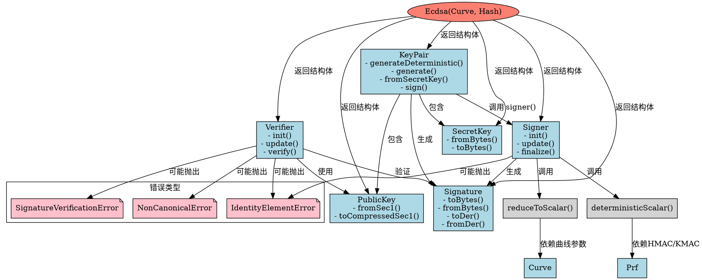

嗯，我需要为提供的Zig代码中的Ecdsa函数生成一个Graphviz流程图。首先，我得仔细看一下代码的结构，理解各个部分的功能和它们之间的关系。代码定义了一个Ecdsa函数，它接受Curve和Hash两个参数，返回一个包含多个结构体和函数的类型。

首先，我会注意到Ecdsa函数内部定义了几个重要的结构体：SecretKey、PublicKey、Signature、Signer、Verifier和KeyPair。每个结构体都有各自的方法，比如fromBytes、toBytes、sign、verify等等。此外，还有一些辅助函数，如reduceToScalar和deterministicScalar。

接下来，我需要确定流程图的节点和它们之间的连接。可能需要将主函数Ecdsa作为起点，然后展示它返回的结构体，以及这些结构体之间的关系。例如，KeyPair包含SecretKey和PublicKey，Signer用于签名，Verifier用于验证，Signature由Signer生成，被Verifier使用。

然后，流程图的边应该反映函数或方法之间的调用关系和数据流动。例如，KeyPair.generate调用generateDeterministic，而generateDeterministic又调用fromSecretKey。Signer的finalize方法可能会调用deterministicScalar和reduceToScalar等辅助函数。

需要注意的是，Graphviz使用节点和有向边来表示结构，所以每个结构体、函数和方法都应该作为节点，调用关系或包含关系作为边。同时，可能需要分组，比如将结构体SecretKey、PublicKey等放在同一个集群中，表示它们属于Ecdsa返回的结构体内部。

在绘制过程中，要确保不遗漏重要的组件，比如Signer和Verifier的初始化过程，以及它们如何与KeyPair和Signature交互。此外，错误处理（如IdentityElementError）也应该在流程图中体现，可能作为边上的标签或单独的节点。

最后，需要验证流程图的准确性，确保所有关键函数和结构体都被包含，并且关系正确。可能需要进行多次调整，以确保图表清晰易懂，符合Graphviz的语法规范。
================================================
