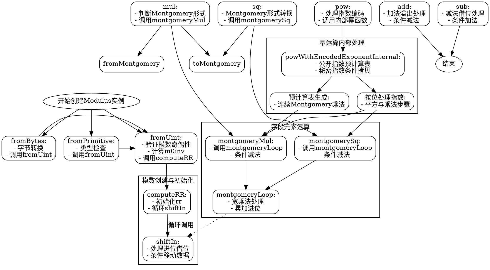

嗯，我现在需要分析用户提供的Zig代码，并为`Modulus`函数生成一个Graphviz的流程图。首先，我得仔细阅读代码，理解它的结构和各个函数的作用。

首先，`Modulus`是一个返回结构体类型的函数，这个结构体包含多个方法和字段，比如`Fe`类型、`v`（模数值）、`rr`（Montgomery表示的R²）、`m0inv`（第一个肢的逆）等。接下来，我需要理清楚这个结构体的主要功能，比如创建模数、处理字段元素的加减乘除运算、Montgomery转换、幂运算等。

接下来，流程图需要展示`Modulus`结构体的主要方法和它们之间的调用关系。例如，`fromUint`方法会调用`computeRR`，而`computeRR`又调用了`shiftIn`。此外，`montgomeryMul`和`montgomerySq`可能被多个方法调用，如`mul`、`sq`、`pow`等。

我需要确定流程图的起点和各个节点。起点应该是用户调用`Modulus`函数创建结构体实例。然后，结构体的各个方法如`add`、`sub`、`mul`、`pow`等会成为不同的节点，并显示它们如何调用内部函数如`montgomeryLoop`、`shiftIn`等。

需要注意错误处理，比如`fromUint`中的错误返回，以及`rejectNonCanonical`等方法中的错误检查。这些错误处理分支也需要在流程图中体现出来。

另外，有些方法之间存在条件判断，比如在`powWithEncodedExponentInternal`中根据指数是否公开选择不同的处理路径。这些条件分支需要用菱形决策节点来表示。

可能的结构是：从`Modulus`开始，分支到各个构造函数（`fromUint`、`fromPrimitive`、`fromBytes`），然后展示这些方法如何初始化结构体字段并调用内部方法（如`computeRR`）。接下来，各个运算方法（`add`、`sub`、`mul`、`sq`、`pow`等）作为节点，显示它们如何调用Montgomery相关的方法和内部循环。

在绘制流程图时，需要确保每个函数调用和条件判断都有正确的箭头指向，并且流程清晰易懂。避免遗漏关键步骤，比如模数的验证（是否奇数、是否足够大）、Montgomery参数的预计算等。

最后，检查是否有循环调用或递归，但根据代码来看，似乎没有递归，主要是方法之间的调用关系。确保所有节点正确连接，并使用合适的图形元素（矩形表示过程，菱形表示判断，椭圆形表示开始/结束等）。

总结一下，流程图的大致结构可能如下：
1. 创建Modulus实例（fromUint/fromPrimitive/fromBytes）。
2. 初始化内部参数（computeRR，计算m0inv等）。
3. 各种运算方法（add、sub等）调用内部Montgomery处理函数。
4. 幂运算的分支处理（公开指数与秘密指数）。
5. 错误处理路径。

现在需要将这些步骤转化为Graphviz的DOT语言，正确表示各个节点和它们之间的关系。
================================================
