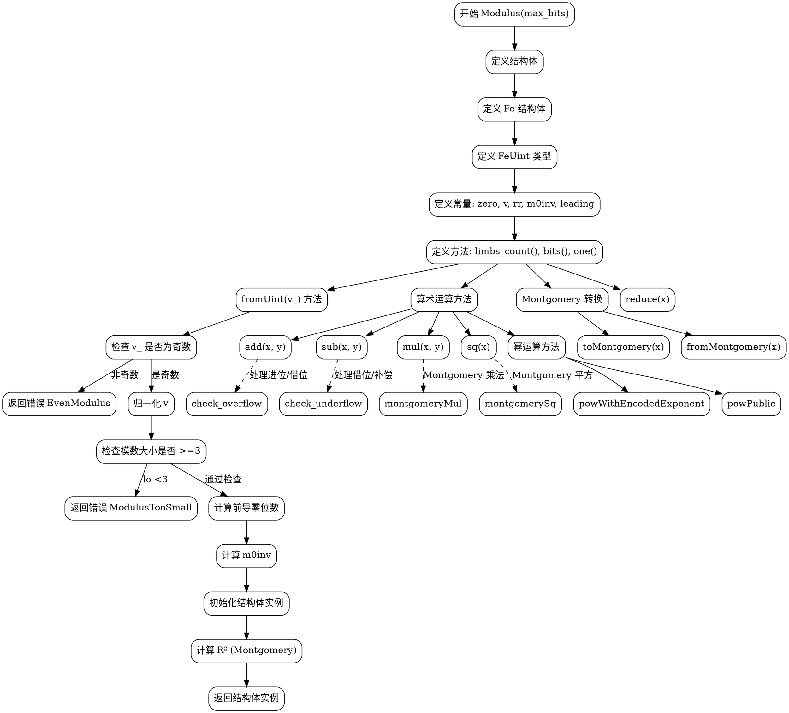

好的，我需要为提供的Zig代码中的`Modulus`函数绘制流程图。首先，我得理解这段代码的结构和功能。

首先，`Modulus`是一个返回结构体类型的函数，该结构体包含了与模数运算相关的方法和属性。结构体中定义了字段元素类型`Fe`，模数值`v`，以及用于蒙哥马利表示的`rr`和`m0inv`等属性。方法包括创建模数实例`fromUint`、`fromPrimitive`、`fromBytes`，以及各种算术运算如加法、减法、乘法、幂运算等。

接下来，我需要确定流程图的范围。由于代码较长且复杂，可能需要分块处理。例如，可以分别处理模数的创建过程、加法、减法、乘法、幂运算等主要功能模块。

对于`fromUint`方法，流程大致如下：
1. 检查模数是否为奇数，否则返回错误。
2. 归一化输入的`v`。
3. 检查模数是否过小。
4. 计算模数的前导零位数。
5. 计算`m0inv`。
6. 初始化结构体实例。
7. 计算`rr`（R²）用于蒙哥马利表示。

对于算术运算如加法：
1. 执行带进位的加法。
2. 检查是否溢出，决定是否需要减去模数。

蒙哥马利乘法部分涉及循环计算，处理进位和借位，需要详细分解步骤。

绘制流程图时，需要注意条件判断和循环结构，例如在`montgomeryLoop`中的循环处理每个肢体（limb）。

可能遇到的挑战是代码中的位操作和蒙哥马利运算的复杂性，需要确保每个步骤都被正确映射到流程图的节点和分支。

最终，流程图将涵盖主要的函数和方法调用，条件判断，循环处理，以及错误处理路径。需要保持层次清晰，模块分明，便于理解整个模数运算的实现逻辑。
================================================
