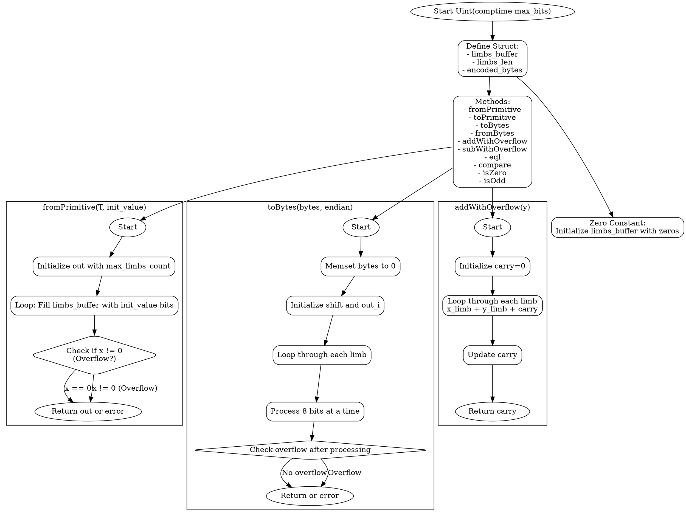

好的，我现在需要为给定的Zig代码中的`Uint`函数生成一个流程图。首先，我需要理解这段代码的结构和功能。

首先，`pub fn Uint(comptime max_bits: comptime_int) type`是一个返回类型的函数。它定义了一个大整数类型，支持各种操作，如初始化、转换、算术运算等。这个结构体有很多方法，比如`fromPrimitive`、`toPrimitive`、`toBytes`、`fromBytes`，以及各种算术运算方法如`addWithOverflow`、`subWithOverflow`等。

接下来，我需要确定如何将这段代码转换为流程图。流程图通常包括开始和结束的节点，判断节点，处理步骤，以及它们之间的流向。由于这是一个返回类型定义的函数，流程图的重点可能是该类型的方法调用流程，或者结构体内部各方法之间的关系。

但是，用户可能希望的是整个`Uint`函数的执行流程，包括它如何构建这个结构体类型，以及各个方法之间的逻辑关系。或者，可能需要为某个特定的方法绘制流程图，比如`fromPrimitive`或`toBytes`。

由于代码中涉及多个方法，可能需要分别绘制它们的流程图。但用户提到的是“函数的流程图”，而这里的函数`Uint`本身是生成一个类型，因此可能需要展示这个类型的方法调用或结构体的整体结构。

另一种可能性是，用户希望看到当调用`Uint`函数时，返回的结构体类型中各方法的逻辑流程，比如初始化、转换、运算等步骤的流程。

我需要进一步澄清，但根据现有信息，可能需要将整个结构体的主要方法及其关系绘制成流程图。例如：

1. 结构体初始化（zero常量）
2. fromPrimitive的流程：检查输入类型，填充limbs_buffer，处理溢出。
3. toPrimitive的流程：逐位转换，处理溢出。
4. toBytes和fromBytes的编码解码过程，考虑大端和小端。
5. 算术运算如addWithOverflow和subWithOverflow的内部逻辑，包括进位和借位的处理。
6. 比较和相等性检查的流程。

每个方法可能有自己的子流程，比如`toBytes`中的循环处理每个limb，处理字节顺序和位移。

对于判断节点，例如在`fromPrimitive`中检查溢出，或者在`toBytes`中处理字节顺序的不同情况，这些都需要分支。

此外，一些辅助方法如`normalize`、`limbs`、`limbsConst`等，可能也需要在流程图中体现它们的调用关系。

需要注意的是，流程图的结构应该清晰，层次分明，可能分模块展示各个功能块，如初始化、转换、运算、比较等。每个模块内部详细展示步骤和判断条件。

现在，我需要将这些步骤转化为Graphviz的DOT语言。每个主要方法作为一个子图，展示其内部流程，或者将它们整合到主流程中。例如：

- 主流程开始于创建Uint类型。
- 包括各个方法的定义和它们之间的关系。
- 每个方法内部的步骤，如循环、条件判断等。

可能的挑战是如何在流程图中简洁地展示所有方法而不显得过于复杂。可能需要选择重点方法进行详细绘制，或者将整个结构分为几个主要部分，每个部分对应一个子图。

例如，可以分以下几个部分：

1. 结构体定义：包含limbs_buffer和limbs_len。
2. 初始化方法：zero常量和fromPrimitive。
3. 转换方法：toPrimitive，toBytes，fromBytes。
4. 运算方法：addWithOverflow，subWithOverflow。
5. 辅助方法：normalize，cmov等。

每个部分内部展示详细的步骤，比如在fromPrimitive中，循环填充limbs_buffer，检查溢出等。

总结，流程图的大致结构可能如下：

- 开始节点：调用Uint函数返回结构体类型。
- 结构体包含字段和方法。
- 每个方法内部的具体流程，如条件判断、循环处理每个limb、处理字节顺序等。
- 方法之间的调用关系，如addWithOverflow调用conditionalAddWithOverflow。

在绘制时，需要使用Graphviz的节点和边来表示这些步骤和关系，使用菱形节点表示判断条件，矩形节点表示处理步骤，箭头表示流程方向。
================================================
