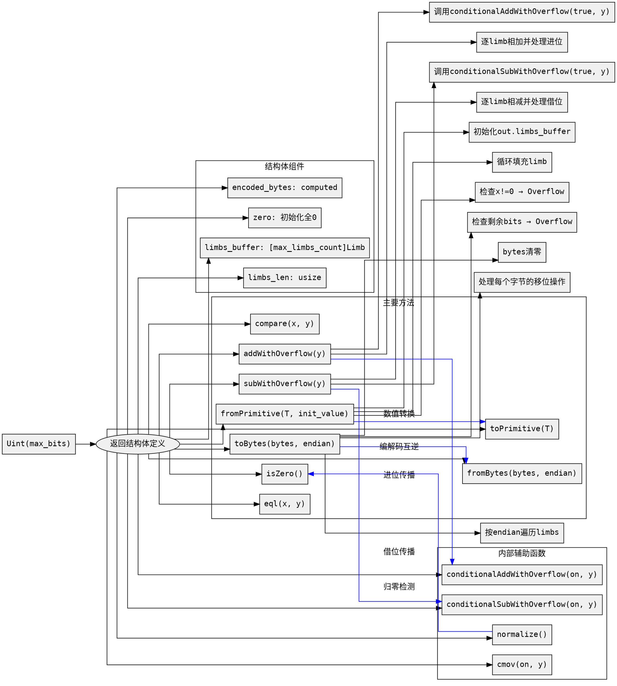

好的，我需要帮用户分析他们提供的Zig代码，并生成对应的Graphviz流程图。首先，我需要理解这段代码的结构和功能。

这段代码定义了一个名为`Uint`的函数，它接受一个编译时常量`max_bits`，返回一个结构体类型。这个结构体代表一个大整数，支持多种操作，如初始化、转换、加减运算、编码解码等。结构体内部有多个方法，包括`fromPrimitive`, `toPrimitive`, `toBytes`, `fromBytes`, `eql`, `compare`, `isZero`, `isOdd`, `addWithOverflow`, `subWithOverflow`等，以及一些内部辅助函数如`normalize`, `cmov`, `conditionalAddWithOverflow`, `conditionalSubWithOverflow`。

接下来，我需要将这些函数和逻辑流程转化为流程图。由于代码结构较为复杂，包含多个方法，可能需要分块处理。例如，主函数`Uint`生成结构体类型，结构体内部包含多个方法。每个方法的逻辑需要单独表示，尤其是那些有循环和条件判断的部分。

需要注意的几个关键点：
1. 结构体的初始化，包括`zero`常量的定义。
2. `fromPrimitive`和`toPrimitive`的转换逻辑，涉及循环和溢出检查。
3. `toBytes`和`fromBytes`的编码解码过程，处理大端和小端模式，以及移位操作。
4. 条件加减操作的流程，包括进位和借位的处理。
5. 辅助函数如`normalize`去除高位零，`cmov`条件赋值等。

在绘制流程图时，应该为每个主要函数创建一个子图，展示其内部步骤，如初始化变量、循环处理每个Limb、溢出检查等。同时，需要表示各个函数之间的调用关系，例如`addWithOverflow`调用`conditionalAddWithOverflow`。

此外，需要注意Graphviz的语法正确性，确保节点和边的正确连接，使用合适的形状和箭头。可能需要使用不同的颜色或形状来区分不同的函数块，以提高可读性。

现在，我需要将这些分析转化为具体的Graphviz代码，确保每个函数的主要步骤都被正确表示，并且整体结构清晰。
================================================
