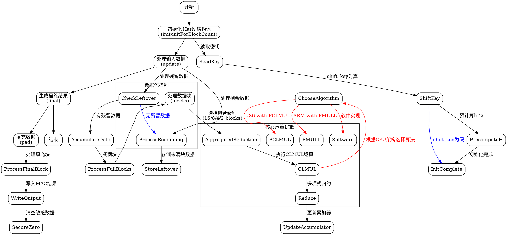

嗯，我需要为这个Zig语言的函数生成一个Graphviz的流程图。首先，我得仔细看看这个代码的结构。这个函数定义了一个Hash结构体，包含多个方法和常量。看起来像是实现了GHASH或Polyval算法，用于加密中的消息认证码（MAC）。

首先，我需要确定流程图的起点和终点。通常，初始化方法init或initForBlockCount是起点，然后update处理数据，最后final生成结果。此外，还有一些内部方法，比如blocks和clmul等，这些可能需要被包含在流程图中。

接下来，考虑各个函数之间的调用关系。例如，update方法会调用blocks处理数据块，而blocks内部又调用了clmul128、reduce等函数。此外，clmul会根据不同的CPU架构选择不同的实现，比如clmulPclmul、clmulPmull或者软件实现的clmulSoft。

我需要将这些方法之间的关系用节点和边表示出来。可能需要将主要的公共方法（如init, update, final）作为主要节点，而内部方法作为子节点。同时，条件判断（如不同的CPU架构选择不同的乘法算法）也需要在流程图中体现出来。

需要注意的是，Graphviz使用DOT语言，所以要正确使用节点和边的语法。可能需要分层，比如将初始化、处理数据、结束作为主要步骤，每个步骤下展开具体的函数调用和处理逻辑。

另外，代码中有一些条件编译，比如根据builtin.mode是否为ReleaseSmall来决定是否展开某些优化路径。在流程图中可能需要用条件节点来表示这些分支。

最后，确保流程图的逻辑正确，没有遗漏重要的步骤，比如密钥处理、块处理、填充（pad）步骤以及最终的归约（reduce）操作。

可能遇到的挑战是如何简洁地表示复杂的逻辑，尤其是条件编译和不同的算法路径。需要找到一种方式，将这些分支合并或分开展示，使流程图既准确又不至于过于复杂。

总结步骤：
1. 确定主要入口点（init, update, final）。
2. 绘制每个方法的内部流程，包括调用的子函数。
3. 处理条件分支，如不同的乘法算法选择。
4. 连接各个步骤，形成完整的处理流程。
5. 使用DOT语法正确表示节点和边。
================================================

该流程图使用分层结构表示：
1. **初始化阶段**：处理密钥读取和预计算
2. **数据处理阶段**：通过update方法处理数据块，包含残留数据管理和聚合运算
3. **结束阶段**：执行填充操作并生成最终MAC值
4. **核心运算模块**：突出显示CLMUL运算和归约操作的多架构实现
5. **条件分支**：用蓝色/红色边表示关键逻辑分支（如shift_key标志和CPU架构选择）