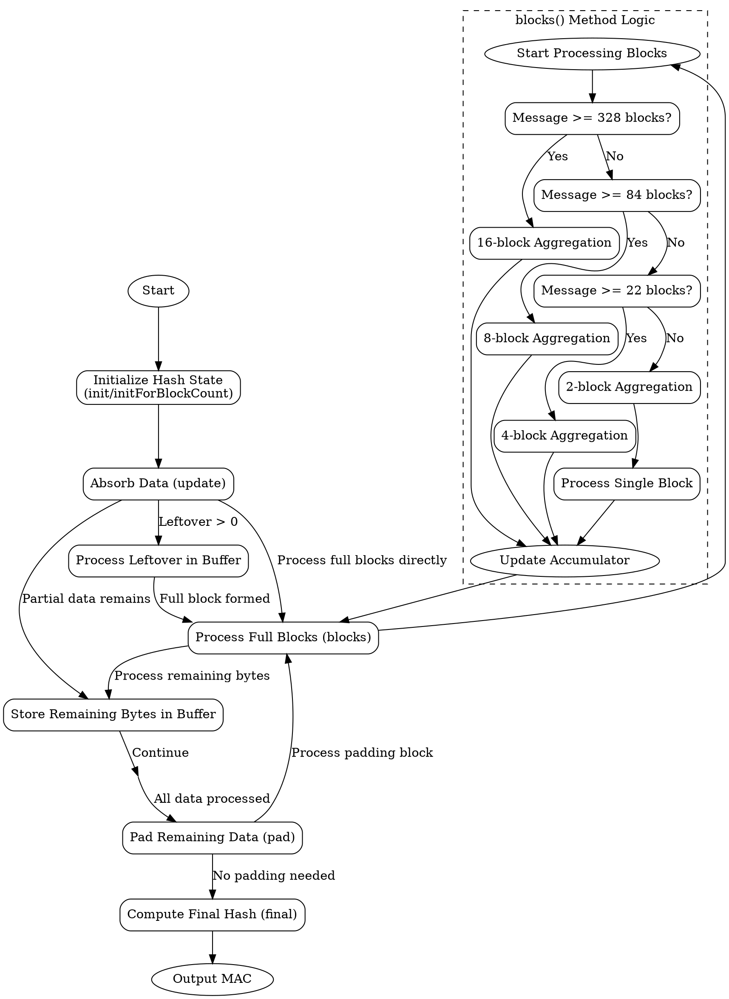

嗯，我现在需要帮用户用Graphviz画出他们提供的Zig函数的流程图。首先，我需要理解这个函数的结构和逻辑。这个函数看起来是一个GHASH的实现，用于加密中的消息认证码。函数名为Hash，返回一个结构体类型，包含多个方法和常量。

首先，我应该确定这个结构体的主要组成部分。结构体有初始化方法initForBlockCount和init，还有处理数据块的blocks方法，以及update、pad、final等方法。此外，还有一些内部函数如clmulPclmul、clmulPmull等用于乘法运算。

接下来，我需要理清函数的主要流程。流程应该从初始化开始，然后处理输入数据，可能分块处理，最后生成MAC。需要考虑各个方法之间的调用关系，比如update会调用blocks处理数据块，而final会调用pad进行填充并输出结果。

然后，我需要将这些步骤转化为流程图中的节点和边。可能的节点包括初始化、处理数据块、更新缓冲区、填充、计算最终结果等。边表示这些步骤之间的顺序和条件转移，例如如果数据不足一个块，则进入缓冲区，否则处理块。

在绘制流程图时，需要注意条件判断，比如在blocks方法中有不同的聚合处理（16块、8块、4块等），这可能需要分支节点。同时，不同的架构处理乘法的方式不同，比如x86和ARM有不同的指令，这可能也需要不同的分支，但可能不需要体现在流程图中，除非用户特别要求。

另外，用户可能希望流程图能展示主要的控制流，而不是每个细节。因此，应该概括主要步骤，如初始化、数据分块处理、填充、最终计算，以及各步骤之间的关系。

最后，需要确保使用正确的Graphviz语法，将各个节点和连接正确表示出来，可能使用矩形表示处理步骤，菱形表示判断条件，箭头表示流程方向。

可能还需要考虑错误处理，比如断言等，但用户提供的代码中没有明显的错误处理分支，所以可能可以忽略。

总结一下，流程图的大致步骤是：

1. 初始化（init或initForBlockCount）
2. 处理输入数据（update方法）
   a. 处理缓冲区中的数据
   b. 处理完整块
   c. 处理剩余数据到缓冲区
3. 填充（pad方法）
4. 计算最终结果（final方法）
5. 输出MAC

每个步骤之间的转换需要正确连接，特别是update中的条件判断（是否有足够的块处理）。此外，blocks方法内部的分块处理逻辑可能需要子流程，但为了简洁，可以将其视为一个整体步骤。

现在需要将这些步骤转化为Graphviz的节点和边，并确保逻辑正确。
================================================
