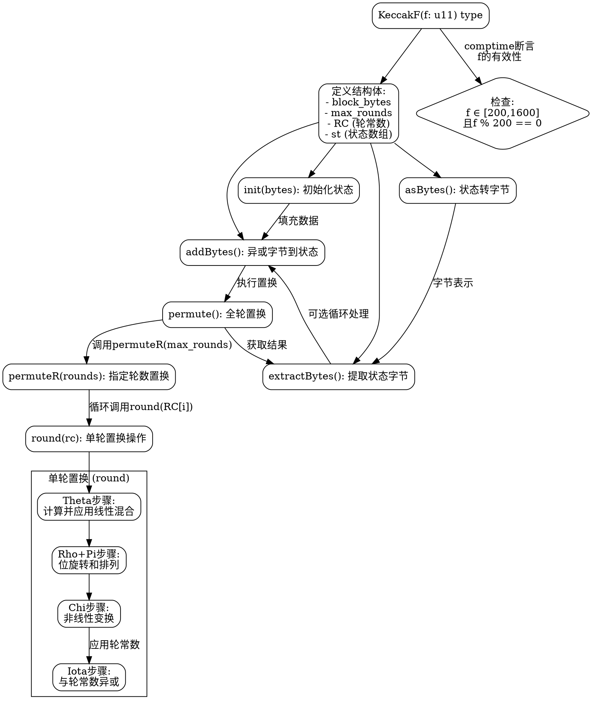

嗯，我需要用Graphviz来画出这个Zig函数的流程图。首先，我要理解这个函数的结构和各个部分的作用。这个函数是KeccakF的实现，它是一个密码学中的置换函数，用于SHA-3算法。

首先，函数`KeccakF`是一个返回类型的泛型函数，接受一个`f`参数，代表状态的大小。函数内部有一些编译时断言和常量定义，比如`PI`数组和`RC`（轮常数）。接下来定义了一个结构体，包含状态`st`和各种方法，比如初始化、字节操作、轮函数等。

流程图应该从函数的入口开始，也就是调用`KeccakF(f)`的地方。然后展示各个方法的调用流程，比如`init`、`permute`、`round`等。需要注意的是，`permute`会调用`permuteR`，而`permuteR`又多次调用`round`函数。`round`函数内部执行theta、rho+pi、chi和iota四个步骤。

接下来，我需要确定各个步骤之间的逻辑关系。例如，初始化状态后，可能会调用`addBytes`或`setBytes`来填充数据，然后调用`permute`进行置换，最后可能调用`extractBytes`获取结果。此外，错误处理如编译时断言也需要在流程图中体现。

Graphviz使用DOT语言，我需要定义节点和边来表示这些步骤。每个函数或主要步骤作为一个节点，箭头表示执行顺序或调用关系。可能需要分层，比如将主函数、初始化、置换过程、轮函数等分开。

在绘制过程中，可能会遇到如何处理循环和条件判断的问题。例如，`permuteR`中的循环调用`round`。可以用节点表示循环的开始和结束，或者用注释说明循环结构。

另外，需要注意各个方法之间的数据流，比如状态`st`如何在方法之间传递和修改。虽然流程图主要关注控制流，但数据流的关键点也可以适当标注。

最后，检查流程图是否清晰展示了函数的主要结构和关键步骤，确保没有遗漏重要部分，并且逻辑正确。
================================================

该流程图展示了：
1. 顶层`KeccakF`函数的编译时检查
2. 状态初始化与数据填充流程
3. 完整的置换过程（permute -> permuteR -> 多轮round调用）
4. 单轮置换的四个核心步骤（Theta/Rho+Pi/Chi/Iota）
5. 状态与字节的相互转换操作
6. 关键方法之间的调用关系和数据流向

节点使用圆角矩形表示操作步骤，菱形表示条件检查，子图分组展示轮函数细节。箭头方向表示执行顺序和调用关系。