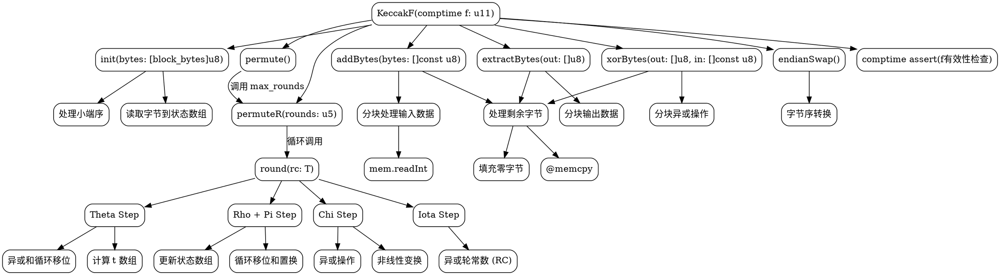

嗯，我现在需要为这个用Zig编写的KeccakF函数画一个流程图。首先，我得仔细看一下代码的结构，理解每个部分的功能，这样才能正确地分解流程。

首先，这个函数是一个泛型函数，根据输入的f参数生成不同的Keccak结构体。里面包含了初始化、处理字节、置换（permutation）等操作。主要关注的是permute和permuteR这两个方法，因为它们是核心的置换步骤。

置换步骤中的round函数是关键，里面包括了theta、rho+pi、chi和iota四个步骤。每个步骤都有特定的操作，比如异或、循环移位等。permuteR函数根据指定的轮数调用round函数，而permute则调用最大轮数。

流程图应该从KeccakF的初始化开始，然后是各个方法，如init、addBytes、permute等，以及它们之间的调用关系。特别是置换过程中的各个步骤需要详细分解，比如theta、rho+pi、chi、iota的顺序和循环结构。

需要注意的是，代码中的一些内联循环和编译时计算，比如PI数组和RC常量的生成，可能不需要在流程图中详细展开，而是作为步骤的一部分表示。另外，错误处理和断言也要考虑进去，比如comptime assert检查f的有效性。

可能的结构是：首先检查f的有效性，定义Block类型和相关常量。然后结构体中的各个方法，如初始化状态、处理字节、置换过程。置换过程需要分解为round函数的各个步骤，以及轮循环。

在绘制流程图时，使用graphviz的语法，用节点表示各个步骤，箭头表示流程走向。例如，主流程从KeccakF开始，分支到init、addBytes等方法，permute调用permuteR，permuteR循环调用round函数，而round函数内部依次执行theta、rho+pi、chi、iota等操作。

需要确保各个步骤的顺序正确，循环和条件分支正确表示。例如，round函数中的各个步骤顺序执行，而permuteR中的循环根据轮数多次调用round。同时，theta阶段的异或和循环移位操作需要作为子步骤展示。

可能还需要注意一些细节，比如在theta阶段计算t数组，然后在rho+pi阶段进行循环移位和置换，接着是chi阶段的非线性变换，最后是iota阶段的异或操作。每个步骤之间的数据流向需要明确。

最后，流程图的结构应该清晰，层次分明，让读者能够一目了然地看到KeccakF函数的整体结构和各个处理步骤的执行顺序。
================================================


该流程图使用 Graphviz 描述以下逻辑：

1. **顶层结构**：`KeccakF` 函数包含初始化、置换、字节操作等方法。
2. **置换流程**：`permute` 调用 `permuteR`，后者循环执行 `round` 函数。每个 `round` 分为四个核心步骤（Theta、Rho+Pi、Chi、Iota）。
3. **步骤分解**：
   - **Theta**：计算临时数组 `t`，通过异或和循环移位更新状态。
   - **Rho+Pi**：循环移位和状态置换。
   - **Chi**：非线性变换（异或与按位非操作）。
   - **Iota**：与轮常数异或。
4. **辅助方法**：如 `addBytes` 分块处理输入数据，`extractBytes` 处理输出，`endianSwap` 处理字节序。
5. **细节操作**：包括小端序处理、内存操作（`@memcpy`）和断言检查。

使用 `dot` 命令行工具生成 SVG/PNG 图像：

```bash
dot -Tsvg keccak_flow.dot -o keccak_flow.svg
```