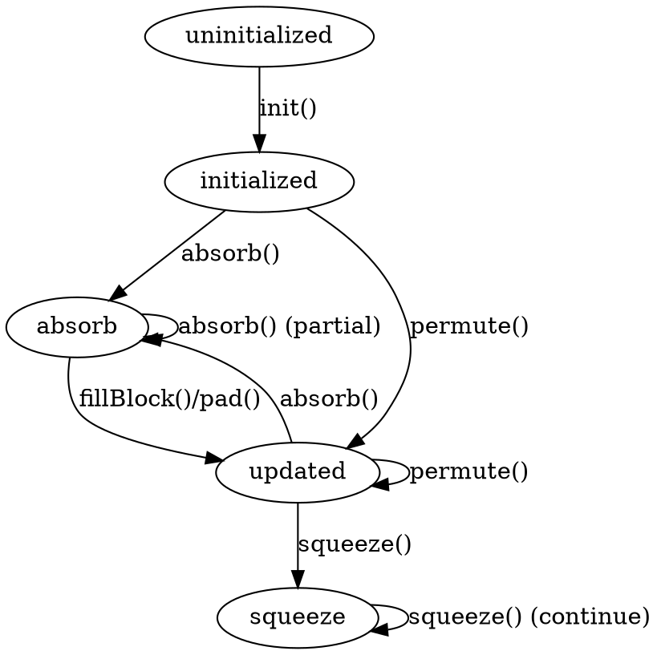

嗯，我现在需要分析用户提供的Zig代码，并生成一个Graphviz的流程图。首先，我应该仔细阅读代码，理解它的结构和各个函数的作用。

代码定义了一个名为State的函数，它返回一个结构体类型。这个结构体似乎是实现了Keccak海绵结构的状态管理，包括初始化、吸收（absorb）、挤压（squeeze）、填充（pad）等操作。结构体内部有多个方法，如init、absorb、permute、fillBlock、pad、squeeze等，每个方法处理不同的状态转换。

接下来，我需要确定如何将这些方法之间的流程和状态转换可视化。用户提到要使用Graphviz，而不是Mermaid，所以我需要确保生成的图表符合Graphviz的语法。

首先，状态转换主要是在TransitionTracker结构体中处理的，尤其是to方法，它根据当前操作（Op枚举）和下一个操作来决定是否允许转换，并在调试模式下进行panic检查。因此，流程图应该反映这些操作之间的允许转换路径。

每个方法可能对应不同的状态转换。例如，init方法将状态从未初始化（uninitialized）变为初始化（initialized）。absorb方法转换到absorb状态，而squeeze转换到squeeze状态。此外，permute、fillBlock和pad等方法可能会将状态转换到updated或其他状态。

我需要列举所有可能的操作（Op枚举值：uninitialized、initialized、updated、absorb、squeeze），然后根据代码中的TransitionTracker.to方法的逻辑，确定每个操作可以转换到哪些其他操作。

例如，在absorb方法中，转换到.absorb状态，而根据TransitionTracker中的逻辑，从某些状态转换到absorb是允许的，而从其他状态（如squeeze）则不允许，会导致panic。不过，流程图可能不需要处理错误路径，而是展示正常流程的转换。

同样，squeeze方法只能在特定状态下调用，如不能在未初始化或刚初始化后调用。但流程图可能需要简化，仅显示主要的成功路径。

另外，各个方法之间的调用关系也需要考虑。例如，absorb可能会调用permuteR方法，但这属于内部实现，可能不需要在流程图中显示，而是关注状态的变化。

可能的流程步骤：

1. 初始化（init）将状态从未初始化转为initialized。
2. 调用absorb，状态转为absorb，处理数据，可能多次调用。
3. 调用fillBlock或pad，处理填充，可能触发permute，状态转为updated。
4. 调用squeeze，状态转为squeeze，输出数据。
5. 在squeeze后，可能需要再次调用permute或重新absorb，但根据TransitionTracker的规则，absorb在squeeze之后是不允许的，所以流程可能需要结束或回到某些状态。

不过，具体需要根据代码中的转换逻辑来确定节点和边。例如：

- initialized状态后，可以absorb或permute吗？
在TransitionTracker的to方法中，当尝试转换到.updated时，检查当前状态是否为.uninitialized，如果是则panic。而initialized状态是否可以转换到.updated？

在permute方法中，状态转为.updated。因此，从initialized状态可以调用permute吗？根据代码中的检查：

permute方法中的检查是，在Debug模式下，如果当前状态是absorb且offset>0，会panic。否则，将状态转为.updated。

所以可能的转换路径：

- initialized → updated（通过调用permute）
- initialized → absorb（通过调用absorb）
- absorb → updated（通过调用fillBlock或pad，或者permute）
- updated → absorb（再次调用absorb）
- updated → squeeze（调用squeeze）
- squeeze → updated（可能需要再次permute？或者squeeze后无法再absorb）

根据TransitionTracker中的squeeze转换检查：

当转换到.squeeze时，当前状态不能是.uninitialized、.initialized或.absorb。即，只有在.updated或.squeeze之后才能调用squeeze？

例如，squeeze的转换逻辑：

case .squeeze:
    switch (tracker.op) {
        .uninitialized => panic,
        .initialized => panic,
        .absorb => panic,
        else => {}
    }

所以，只有当当前状态是.updated或.squeeze时，可以转换到.squeeze。也就是说，在调用squeeze之前，必须已经处于.updated状态或者已经是squeeze状态。

因此，可能的流程是：

init → initialized → absorb → (fillBlock/pad → updated) → squeeze → ... 

或者，在absorb之后直接调用squeeze会panic，所以需要先通过fillBlock或pad将状态转为updated，才能调用squeeze。

总结状态转换：

- uninitialized → initialized（通过init）
- initialized → absorb（调用absorb）
- initialized → updated（调用permute）
- absorb → absorb（继续absorb）
- absorb → updated（调用fillBlock或pad）
- updated → absorb（再次absorb）
- updated → squeeze（调用squeeze）
- squeeze → squeeze（继续squeeze）
- squeeze → updated（调用permute？或者无法转换？）

此外，pad方法会将状态转为.updated。而squeeze方法转换到.squeeze，并且在后续调用squeeze时可能继续处于该状态。

接下来，需要将这些状态和转换用Graphviz的节点和边表示出来。每个状态（Op枚举值）作为节点，方法调用作为边上的标签。

可能的节点：

- uninitialized
- initialized
- absorb
- updated
- squeeze

边：

- init方法：uninitialized → initialized
- absorb方法：initialized → absorb；absorb → absorb；updated → absorb
- fillBlock/pad方法：absorb → updated
- permute方法：initialized → updated；absorb → updated（需要检查代码逻辑）
- squeeze方法：updated → squeeze；squeeze → squeeze

另外，可能还有其他边，比如从updated调用permute，但permute会将状态转为updated，所以可能是一个自环边？

需要仔细检查每个方法中的transition.to调用：

- absorb方法调用transition.to(.absorb)
- init方法调用transition.to(.initialized)
- permute方法调用transition.to(.updated)
- fillBlock调用transition.to(.absorb)和.to(.updated)
- pad调用transition.to(.absorb)和.to(.updated)
- squeeze调用transition.to(.squeeze)

例如，fillBlock的流程：

fillBlock方法中，首先转换到.absorb，然后处理数据，再转换到.updated。

因此，fillBlock的调用会导致状态从当前状态（可能是absorb）到.updated。同样，pad方法也会转到.updated。

可能需要更详细的分析每个方法中的transition.to调用：

- init → .initialized
- absorb → .absorb
- permute → .updated
- fillBlock: 先到.absorb，然后到.updated
- pad: 先到.absorb，然后到.updated
- squeeze → .squeeze

因此，fillBlock和pad方法内部会先转换到.absorb，然后处理完后再转换到.updated。所以在流程图中，调用fillBlock或pad时，状态会从当前状态（比如absorb）经过.absorb再到.updated？

或者，fillBlock的调用者当前状态是absorb，调用fillBlock后转为updated。

这可能比较复杂，可能需要将每个方法调用后的状态转换明确表示出来。

例如：

当在absorb状态调用fillBlock：

fillBlock内部的transition.to(.absorb)（此时状态已经是absorb，所以可能不会有变化），然后处理数据后，调用transition.to(.updated)。所以，整体状态从absorb → updated.

同样，pad方法内部也会将状态从absorb → updated.

因此，在流程图中，从absorb状态调用fillBlock或pad会转到updated状态。

同样，在initialized状态调用permute会转到updated状态。

squeeze方法只能在updated或squeeze状态下调用，并转换到squeeze状态。

现在，需要将这些转换绘制成流程图，可能包括：

- 初始状态：uninitialized
- 调用init → initialized
- 在initialized状态下，可以调用absorb → absorb，或者调用permute → updated
- 在absorb状态下，可以继续调用absorb（处理更多数据），或者调用fillBlock/pad → updated
- 在updated状态下，可以调用absorb（再次开始吸收数据），或者调用squeeze → squeeze
- 在squeeze状态下，可以继续调用squeeze（输出更多数据），或者可能无法回到其他状态？

此外，需要注意错误路径（如不允许的转换），但用户可能只需要正常流程，所以可能不需要包含panic的情况。

现在，将这些转换为Graphviz的节点和边：

digraph {
    uninitialized -> initialized [label="init"];
    initialized -> absorb [label="absorb"];
    initialized -> updated [label="permute"];
    absorb -> absorb [label="absorb"];
    absorb -> updated [label="fillBlock/pad"];
    updated -> absorb [label="absorb"];
    updated -> squeeze [label="squeeze"];
    squeeze -> squeeze [label="squeeze"];
}

这样可能涵盖了主要的正常流程转换。可能还需要考虑其他可能的转换，比如在updated状态调用permute，但permute方法会将状态转为updated，所以可能是一个自环边：

updated -> updated [label="permute"];

同样，squeeze状态下是否可以调用其他方法？根据代码，一旦进入squeeze状态，之后调用absorb会panic，所以流程图中可能不允许从squeeze转到其他状态，除了继续squeeze。

这样，最终的Graphviz代码可能如下：

digraph {
    uninitialized -> initialized [label="init"];
    initialized -> absorb [label="absorb"];
    initialized -> updated [label="permute"];
    absorb -> absorb [label="absorb"];
    absorb -> updated [label="fillBlock/pad"];
    updated -> absorb [label="absorb"];
    updated -> updated [label="permute"];
    updated -> squeeze [label="squeeze"];
    squeeze -> squeeze [label="squeeze"];
}

这样，每个状态之间的转换都被正确表示，边上的标签是对应的方法调用。
================================================
