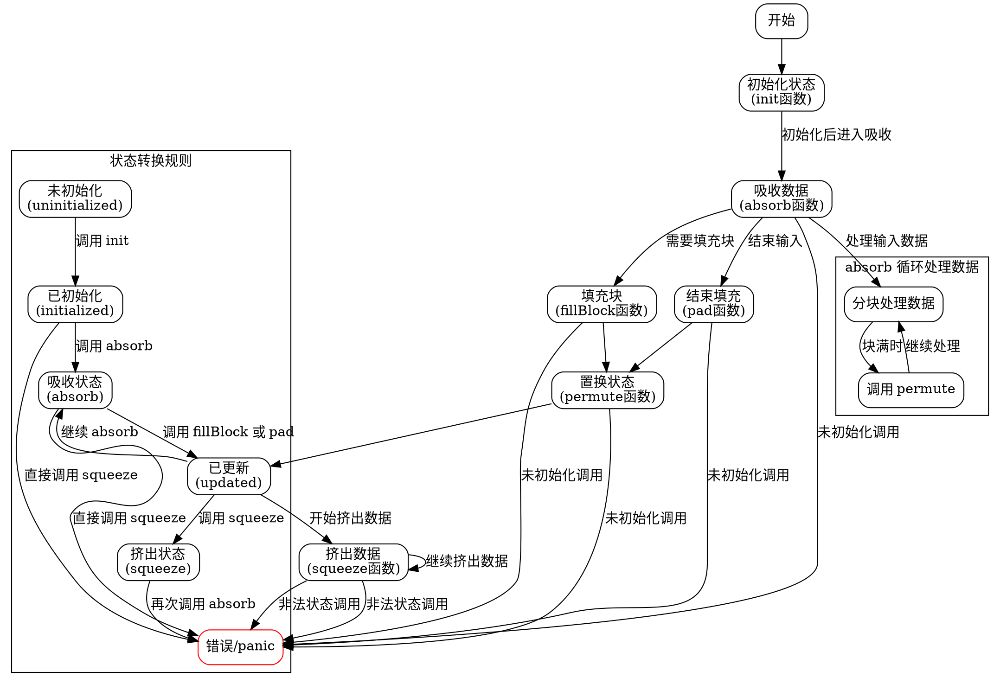

嗯，我需要用Graphviz来画出这个Zig函数的流程图。首先，我得仔细看看这个代码的结构。这个函数定义了一个State类型，里面有很多方法，比如absorb、init、permute、fillBlock、pad、squeeze等。每个方法都有不同的逻辑和状态转换。

首先，我应该确定主要的函数和它们之间的调用关系。比如，absorb可能会调用permute，而pad也会调用permute。还有状态转换的部分，比如TransitionTracker，用来跟踪不同的操作步骤，比如从uninitialized到initialized，再到absorb，squeeze等。

然后，我需要把这些函数和状态转换用流程图的形式表示出来。每个函数作为一个节点，函数之间的调用或状态转换作为边。比如，init之后可能进入absorb，absorb之后可能调用fillBlock或者pad，然后进入squeeze。

不过，状态转换的规则在TransitionTracker里，这部分可能需要单独处理。比如，在调用absorb之前，必须处于某些特定的状态，否则会panic。这些状态转换可能需要在流程图中用条件判断来表示。

另外，还需要考虑循环结构，比如在absorb方法中的while循环，处理输入数据的分块处理。这可能在流程图中需要循环节点。

可能还需要考虑不同的模式，比如debug模式下的状态检查和release模式下的不同行为。不过，流程图可能主要关注逻辑流程，而不是具体模式的区别。

接下来，我需要将每个函数的主要步骤拆解成流程图的节点。比如，absorb函数中有检查offset、拷贝数据、调用permute等步骤。每个步骤作为一个节点，并根据逻辑顺序连接起来。

对于状态转换，比如从uninitialized到initialized，再到absorb或squeeze，需要将这些状态作为节点，并标明转换的条件。例如，调用init后状态变为initialized，之后才能调用absorb或squeeze。

可能还需要处理错误情况，比如在错误的状态下调用某个方法会导致panic，这些错误路径也需要在流程图中体现。

总的来说，我需要：

1. 列出所有主要函数和状态。
2. 确定它们之间的调用关系和状态转换。
3. 用Graphviz的节点和边表示这些关系，包括条件和循环。
4. 确保流程图的逻辑清晰，覆盖主要的执行路径和错误处理。

可能需要分几个部分来画，比如初始化流程、吸收数据流程、填充块流程、挤压输出流程等，每个部分有各自的子图，最后整合在一起。

在画图时，需要注意函数之间的调用顺序，以及状态转换的条件。例如，squeeze只能在某些状态下调用，否则会panic，这需要在流程图中用条件判断节点来表示。

可能需要多次检查代码，确保没有遗漏重要的步骤或条件。同时，流程图的结构要尽量简洁，避免过于复杂，影响可读性。
================================================

该流程图包含以下核心部分：

1. **状态转换规则**（右侧灰色区域）：
   - 明确标注了 Keccak 状态机的合法转换路径
   - 使用颜色标注错误路径（红色）

2. **主函数调用流程**：
   - 从初始化开始，到吸收数据、填充处理、最终挤出数据的完整流程
   - 包含各函数间的调用关系

3. **错误处理路径**：
   - 标注所有可能导致 panic 的非法状态转换

4. **absorb 函数内部循环**：
   - 单独用子图展示数据分块处理和置换的循环过程

5. **关键函数节点**：
   - 使用圆角矩形表示每个核心函数
   - 用箭头标注函数间的调用顺序

建议使用 Graphviz 工具渲染时：
1. 保持布局引擎为默认的 dot
2. 可以添加 `rankdir=LR` 获得横向布局
3. 使用不同颜色区分正常流程和错误路径