嗯，我需要用Graphviz来画这个Zig函数的流程图。首先，我得先理解这个代码的结构。这个函数定义了一个Kyber结构体，里面包含了很多子结构，比如PublicKey、SecretKey、KeyPair，还有InnerPk和InnerSk这些内部类型。每个子结构都有自己的方法，比如encaps、decaps、generateDeterministic等。

流程图应该从Kyber结构体的入口开始，然后分支出各个子模块。比如，PublicKey的encaps方法，SecretKey的decaps方法，KeyPair的生成过程等。每个方法内部还有步骤，比如生成随机数、哈希计算、加密解密操作等。

我需要确定各个函数之间的调用关系和数据流向。例如，PublicKey的encaps方法中调用了InnerPk的encrypt方法，而InnerPk的fromBytes方法又涉及到哈希和矩阵操作。同时，KeyPair的generateDeterministic方法调用了innerKeyFromSeed函数来生成内部密钥对。

另外，要注意条件判断，比如p.ml_kem的不同处理分支。这时候流程图里可能需要条件判断的菱形框，分出不同的处理路径。

可能还需要处理错误情况，比如fromBytes中的错误返回，但流程图可能主要关注正常流程，错误处理可以简化或忽略。

接下来，我需要用Graphviz的语法来表示这些结构。每个主要的结构体作为一个节点，方法作为子节点，用箭头表示调用或数据流动。可能需要使用子图来组织PublicKey、SecretKey等部分。

需要注意的是，代码中有很多内部函数和变量，比如V、M、Poly等，这些可能在流程图中简化为步骤，而不需要详细展开，否则图表会过于复杂。

最后，要确保流程图的逻辑清晰，层次分明，方便理解整个Kyber结构的运作流程。
================================================

```dot
digraph Kyber_Flowchart {
    rankdir=TB;
    node [shape=rectangle, style=rounded];

    // 顶层结构
    Kyber [label="Kyber 结构体\n(ciphertext_length, shared_length, name)"];
    PublicKey [label="PublicKey 结构体\n(encaps, toBytes, fromBytes)"];
    SecretKey [label="SecretKey 结构体\n(decaps, toBytes, fromBytes)"];
    KeyPair [label="KeyPair 结构体\n(generateDeterministic, generate)"];
    InnerPk [label="InnerPk 结构体\n(encrypt, toBytes, fromBytes)"];
    InnerSk [label="InnerSk 结构体\n(decrypt, toBytes, fromBytes)"];

    // 连接顶层结构
    Kyber -> PublicKey;
    Kyber -> SecretKey;
    Kyber -> KeyPair;
    Kyber -> InnerPk;
    Kyber -> InnerSk;

    // PublicKey 的方法和流程
    PublicKey -> "encaps()" [label="封装过程"];
    "encaps()" -> "生成随机数 m" [label="seed_ ?"];
    "encaps()" -> "计算 (K', r) = G(m ‖ H(pk))";
    "encaps()" -> "调用 InnerPk.encrypt()";
    "encaps()" -> "返回 EncapsulatedSecret";

    // SecretKey 的方法和流程
    SecretKey -> "decaps()" [label="解封装过程"];
    "decaps()" -> "调用 InnerSk.decrypt()";
    "decaps()" -> "计算 (K'', r') = G(m' ‖ H(pk))";
    "decaps()" -> "验证 ct' 与原始 ct";
    "decaps()" -> "返回共享密钥";

    // KeyPair 生成流程
    KeyPair -> "generateDeterministic()" [label="确定性生成"];
    "generateDeterministic()" -> "调用 innerKeyFromSeed()";
    "generateDeterministic()" -> "计算 H(pk)";
    KeyPair -> "generate()" [label="随机生成"];
    "generate()" -> "生成随机种子";

    // InnerPk 加密流程
    InnerPk -> "encrypt()" [label="内部加密"];
    "encrypt()" -> "采样 r, e₁, e₂";
    "encrypt()" -> "计算 u = Aᵀ r + e₁";
    "encrypt()" -> "计算 v = <t, r> + e₂ + m";
    "encrypt()" -> "压缩返回 ciphertext";

    // InnerSk 解密流程
    InnerSk -> "decrypt()" [label="内部解密"];
    "decrypt()" -> "解压 u 和 v";
    "decrypt()" -> "计算 m = v - <s, u>";
    "decrypt()" -> "返回解压后的明文";

    // 条件分支（ML-KEM 与 Kyber 区别）
    "encaps()" -> "条件 p.ml_kem?" [shape=diamond];
    "条件 p.ml_kem?" -> "ML-KEM 路径" [label="是"];
    "条件 p.ml_kem?" -> "Kyber 路径" [label="否"];
    "ML-KEM 路径" -> "直接使用 K'";
    "Kyber 路径" -> "计算 KDF(K' ‖ H(c))";

    // 数据流标注
    edge [style=dashed, color=blue];
    "encaps()" -> "PublicKey.pk";
    "decaps()" -> "SecretKey.sk";
    "generateDeterministic()" -> "seed[inner_seed_length..]";
}
```
