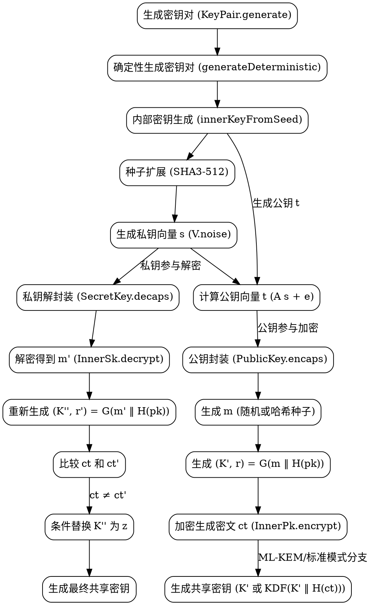

好的，我需要为提供的Zig代码中的Kyber函数绘制一个流程图。首先，我需要理解代码的结构和主要功能。

首先，这个Kyber函数是一个泛型结构体，根据传入的参数p来配置不同的行为。主要包含以下几个部分：

1. **常量定义**：如ciphertext_length、shared_length等。
2. **EncapsulatedSecret结构体**：包含共享密钥和密文。
3. **PublicKey结构体**：处理公钥的封装（encaps）方法，包括生成共享密钥和密文，以及序列化和反序列化方法。
4. **SecretKey结构体**：处理私钥的解封装（decaps）方法，同样包括序列化和反序列化。
5. **KeyPair结构体**：生成密钥对的方法，包括确定性和随机生成。
6. **内部结构体InnerPk和InnerSk**：实现具体的加密和解密逻辑。
7. **辅助函数**：如innerKeyFromSeed用于从种子生成内部密钥对。

接下来，我需要确定流程图的主要流程节点：

- **密钥生成**：
  - 生成公钥和私钥（KeyPair.generate和generateDeterministic）。
  - 内部调用innerKeyFromSeed生成内部密钥对。

- **封装（Encapsulation）**：
  - 公钥的encaps方法生成共享密钥和密文。
  - 使用随机或确定性种子生成m。
  - 通过哈希生成kr，然后使用innerEncrypt生成密文ct。
  - 根据参数选择ML-KEM或标准Kyber处理共享密钥。

- **解封装（Decapsulation）**：
  - 私钥的decaps方法解析密文。
  - 解密得到m'，重新生成kr2和ct2。
  - 比较ct和ct2，决定是否使用z替换K''，最终生成共享密钥。

需要注意的流程分支：
- 是否使用ML-KEM影响共享密钥的生成方式。
- 在encaps中，种子是否存在决定m的生成方式（随机或哈希种子）。
- 在decaps中，ct是否等于ct2决定是否替换K''为z。

接下来，我需要将这些步骤转化为Graphviz的节点和边，确保逻辑正确，分支清晰。同时，注意函数之间的调用关系，如encaps调用InnerPk的encrypt方法，而decaps调用InnerSk的decrypt方法。

最后，检查是否有遗漏的步骤或错误的分支，确保流程图准确反映代码逻辑。
================================================
