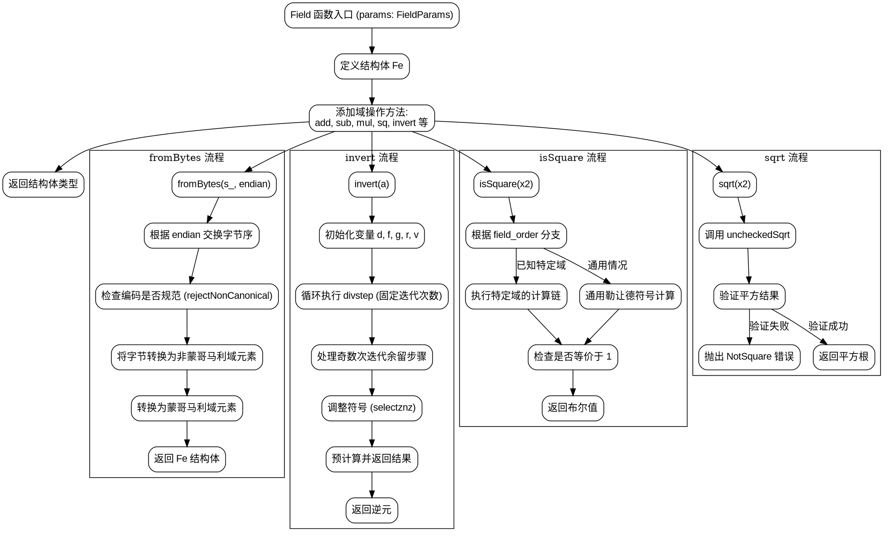

嗯，我需要为这段Zig代码中的Field函数绘制一个流程图。首先，我应该理解这段代码的结构和主要功能。看起来这个函数是定义了一个有限域的结构体，包含各种操作，如加法、减法、乘法、平方、求逆、平方根检测等。

首先，Field函数接受一个参数params，类型为FieldParams，然后返回一个结构体类型。这个结构体有很多方法，比如fromBytes、toBytes、add、sub、mul、invert、isSquare、sqrt等等。每个方法都有特定的功能，比如fromBytes将字节数组转换为域元素，并进行非规范编码的检查。

接下来，我需要确定如何将这些方法组织成流程图。流程图通常从入口点开始，然后根据不同的操作分支。由于这是一个结构体的定义，可能没有单一的入口点，但可以考虑从公共方法如fromBytes、add、invert等开始，展示它们的流程。

对于每个方法，我需要分析其步骤。例如，fromBytes函数首先检查字节的编码是否规范，然后将字节转换为域元素。invert函数使用特定的算法进行求逆操作，涉及循环和条件判断。isSquare方法根据不同的field_order有不同的计算路径，需要处理条件分支。

需要注意条件判断和循环结构，比如pow函数中的循环处理指数，invert中的循环迭代。此外，错误处理如rejectNonCanonical可能抛出错误，需要在流程图中体现。

最后，我需要确保流程图的每个节点清晰展示函数的逻辑流程，包括开始、处理步骤、条件判断、循环、错误处理和结束。可能需要将复杂的函数拆分成子流程，比如将invert的多次迭代简化为一个循环节点。

总结来说，我需要将每个主要方法分解为步骤，用图形化的节点和箭头表示流程，处理条件分支和循环，并确保错误路径也被正确表示。
================================================
