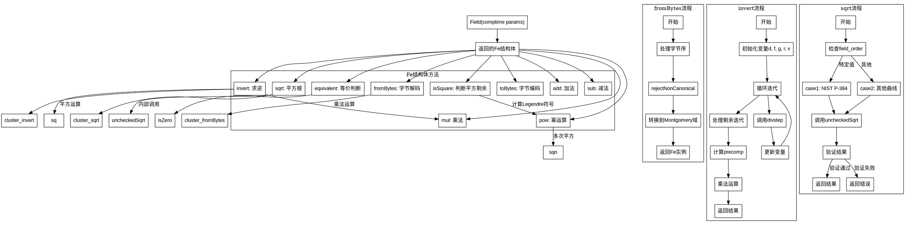

好的，我需要帮用户用Graphviz画出给定Zig代码中Field函数的流程图。首先，我需要理解这段代码的结构和逻辑。

首先，这个函数是pub fn Field(comptime params: FieldParams) type，看起来是定义一个类型，返回一个结构体。结构体Fe有很多方法，比如add、sub、mul、invert等。每个方法可能有不同的逻辑分支，比如条件判断、循环等。

用户需要的是整个Field函数的流程图，可能需要涵盖各个方法之间的调用关系和主要逻辑流程。不过，Graphviz通常用于展示结构化的图表，比如模块之间的关系、函数调用流程，或者某个特定函数的控制流。

考虑到代码较长，可能无法将所有细节都画在一个图中，但可以画出主要的结构。比如，Fe结构体的各个方法作为节点，它们之间的关系用箭头连接。或者，针对特定重要方法（如invert、sqrt）画出其内部的控制流程。

不过，用户可能希望的是整个Field函数的总体流程图，可能包括结构体的各个方法如何被组织，以及它们之间的依赖关系。或者，可能希望展示Field函数如何根据params参数生成对应的类型结构。

另外，需要注意代码中有条件编译和不同的field_order处理，比如不同的椭圆曲线参数（如field_order的值不同时，isSquare和uncheckedSqrt有不同的实现）。这部分在流程图中可能需要条件分支来表示不同的处理路径。

可能的步骤：
1. 确定流程图的范围：是整个Field函数生成的类型结构，还是某个特定方法（如invert）的内部流程？
2. 分析代码结构，识别主要的函数和方法。
3. 确定各个节点（如函数、条件判断、循环）和它们之间的关系。
4. 使用Graphviz的DOT语言将这些节点和关系描述出来。

比如，对于Fe结构体，可能有构造函数fromBytes、toBytes，运算方法add、sub、mul，以及invert、sqrt等方法。每个方法可能有自己的子流程，比如invert中有循环和条件判断。

不过，将所有方法都画在一个流程图中可能会过于复杂。可能需要分块处理，或者选择核心方法进行绘制。

用户可能更关心的是整个结构体的主要功能流程，比如如何从字节转换为Fe，进行运算，最后转换为字节或其他形式。或者，可能希望看到关键算法如invert和sqrt的控制流程。

例如，invert函数使用了迭代和divstep操作，这可能涉及到循环和条件选择。而sqrt函数则根据不同的field_order有不同的计算路径，需要条件分支。

接下来，我需要将代码中的主要流程转换为Graphviz的节点和边。例如：

- Field函数返回的结构体包含多个方法。
- 每个方法如fromBytes、toBytes、add、sub等作为子图。
- 方法内部的条件判断（如rejectNonCanonical中的比较）作为决策节点。
- 循环结构（如sqn中的while循环）用循环节点表示。
- 不同field_order的条件分支（如isSquare中的多个if分支）作为条件节点。

不过，Graphviz的流程图通常更适合单个函数的控制流程，而不是整个结构体的所有方法。可能需要将每个主要方法单独绘制，或者以结构体为中心，展示各方法之间的关系。

或者，可以绘制一个高级别的结构图，显示Fe结构体的各个方法及其依赖关系，比如fromBytes调用rejectNonCanonical，invert调用mul和sq等。

另一种方式是将整个Field函数的生成过程作为流程图，展示如何根据params参数生成对应的类型结构，包括各个常量和方法的定义。

不过，可能用户更希望看到的是某个特定方法的内部流程图，比如invert或sqrt，因为这些方法逻辑较为复杂。

需要进一步确认用户的需求，但根据问题描述，用户要求的是整个函数的流程图，所以可能需要涵盖主要部分。

现在，我需要开始编写Graphviz的DOT代码。可能的思路是：

- 将结构体的主要方法作为节点。
- 显示方法之间的调用关系，比如sqrt调用uncheckedSqrt，pow调用mul和sq。
- 条件分支用菱形节点表示，比如isSquare中的不同field_order判断。
- 循环结构用箭头和节点表示。

不过，由于代码复杂，可能需要简化，只展示主要流程，忽略部分细节。例如：

1. Field函数创建Fe结构体。
2. Fe结构体包含fromBytes、toBytes、add、sub等方法。
3. invert方法内部有一个循环和条件判断。
4. sqrt方法根据field_order选择不同的计算路径。

可能需要将每个方法的流程分解成子图，然后通过主图连接这些子图。但Graphviz中子图的使用可能不太适合，可能需要分层结构。

由于时间有限，可能需要选择核心函数进行详细绘制，比如invert和sqrt，因为它们的逻辑较为复杂，而其他方法作为简单节点。

总结，可能的Graphviz图结构：

digraph Field {
    node [shape=rectangle];
    FieldFunction -> FeStruct;
    FeStruct [label="Fe结构体"];
    FeStruct -> fromBytes;
    FeStruct -> toBytes;
    FeStruct -> add;
    FeStruct -> sub;
    FeStruct -> mul;
    FeStruct -> invert;
    FeStruct -> sqrt;
    invert -> divstep;
    invert -> selectznz;
    invert -> 循环迭代;
    sqrt -> 条件判断field_order;
    sqrt -> 不同计算路径;
    // 其他方法的关系
}

但需要更具体的节点和边。例如，invert函数的内部流程：

digraph Invert {
    start [label="开始"];
    check_zero [label="检查a是否为0"];
    compute_iterations [label="计算迭代次数"];
    init_vars [label="初始化变量d, f, g, r, v"];
    loop [label="循环迭代"];
    divstep_call [label="调用divstep"];
    update_vars [label="更新变量"];
    check_remaining_iterations [label="处理剩余迭代"];
    compute_precomp [label="计算precomp"];
    multiply_v_precomp [label="相乘得到结果"];
    end [label="返回fe"];

    start -> check_zero;
    check_zero -> compute_iterations;
    compute_iterations -> init_vars;
    init_vars -> loop;
    loop -> divstep_call -> update_vars -> loop;
    loop -> check_remaining_iterations;
    check_remaining_iterations -> compute_precomp;
    compute_precomp -> multiply_v_precomp -> end;
}

不过，这只是一个示例。需要根据代码中的具体逻辑来绘制。

最终，可能需要将整个Field函数的结构和主要方法的关系用Graphviz表示，同时详细绘制关键方法的内部流程。但由于代码量较大，可能需要分多个图或者简化。
================================================

该流程图使用Graphviz的DOT语言绘制，包含以下部分：

1. **顶层结构**：展示Field函数生成Fe结构体的核心逻辑
2. **主要方法**：以子图形式展示fromBytes、invert、sqrt等核心方法的内部流程
3. **条件分支**：特别展示sqrt方法中根据field_order不同进行不同计算的逻辑
4. **关键依赖**：显示方法之间的调用关系（如pow调用sqn，sqrt调用uncheckedSqrt）

流程图采用分层结构：
- 矩形节点表示操作步骤
- 菱形节点表示条件判断
- 子图封装复杂方法的内部逻辑
- 箭头表示执行顺序和调用关系