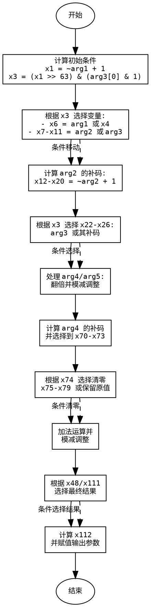

好的，我现在需要为一个用 Zig 写的函数绘制流程图。这个函数是 crypto/pcurves/p256/p256_64.zig 中的 divstep 函数。首先，我得仔细阅读代码，理解它的结构和逻辑，然后才能画出正确的流程图。

首先，函数签名是：
pub fn divstep(out1: *u64, out2: *[5]u64, out3: *[5]u64, out4: *[4]u64, out5: *[4]u64, arg1: u64, arg2: [5]u64, arg3: [5]u64, arg4: [4]u64, arg5: [4]u64) void {

看起来这个函数有多个输出参数，out1到out5，以及多个输入参数arg1到arg5。函数内部有很多变量和操作，特别是使用了很多条件移动（cmovznzU64）和进位/借位操作（addcarryxU64，subborrowxU64）。可能涉及到大数运算，比如椭圆曲线中的运算步骤。

接下来，我需要分解函数的步骤：

1. 初始部分：计算x1和x2，通过addcarryxU64(~arg1 + 1)。这可能是在计算补码或者某种条件判断。
2. 计算x3，通过截断x1的高位和arg3[0]的最低位进行位运算。这里可能是一个条件判断，比如判断奇偶性。
3. 接下来的几个cmovznzU64操作，根据x3的值选择不同的值，可能是在处理不同的分支条件。
4. 之后有很多addcarryxU64和subborrowxU64的操作，处理进位和借位，可能是在进行大数的加减运算。
5. 中间涉及到多个变量之间的运算，如x31到x38的计算，可能是在进行某种模运算或者乘法运算。
6. 后面的cmovznzU64根据不同的条件（如x48, x111等）选择不同的结果，这可能是在处理不同的情况下的结果输出。
7. 最后将结果赋值给各个out参数。

为了画流程图，需要将这些步骤模块化，并确定各个步骤之间的流程关系。可能的流程包括：

- 初始条件和变量初始化。
- 条件分支（由x3决定）。
- 进行一系列的算术运算，包括加减、进位处理。
- 条件移动操作，选择不同的结果路径。
- 处理模运算或调整步骤（如subborrowxU64后的调整）。
- 最后的输出赋值。

需要注意，这个函数可能涉及循环展开的步骤，或者是一个特定的算法步骤，比如divstep可能是某种迭代算法中的一步（如二进制扩展欧几里得算法中的一步）。

接下来，我需要确定各个部分的逻辑结构，比如条件判断后的不同处理流程，以及各个计算步骤之间的依赖关系。例如，x3的条件会影响后续多个变量的选择，这可能形成一个条件分支，之后根据不同的分支进行计算。

可能的结构：

开始 -> 计算初始变量（x1, x2, x3） -> 根据x3选择不同的路径 -> 处理一系列的算术运算 -> 条件调整 -> 最终结果赋值到输出参数。

对于每个条件判断，例如cmovznzU64，可能需要画出两个分支，但因为这些是条件移动而不是跳转，所以可能在流程图中表示为条件选择，而不是分支路径。

需要注意的是，流程图中应使用图形化的元素，如开始/结束节点、处理步骤、条件判断、输入/输出等。由于代码中没有循环结构，所有的操作都是线性的，但有条件选择，所以可能需要用判断节点来表示条件的影响。

例如：

开始节点 → 初始化x1, x2 → 计算x3 → 根据x3选择不同的变量 → 后续的加减运算 → 条件调整 → 结果输出。

可能具体的步骤需要更详细的分解，每个算术运算步骤可能需要表示为处理框，而条件选择作为判断框。

但是，由于代码非常密集且包含许多变量，可能需要将某些步骤合并成较大的块，例如将一系列的addcarryxU64和cmovznzU64操作合并为一个处理块，说明其整体功能，而不是每个单独的操作。

另外，函数的结尾部分有多个out参数的赋值，需要将这些作为输出节点。

总结，流程图的大致结构可能如下：

1. 开始
2. 计算初始条件（x1, x2, x3）
3. 根据x3选择arg1或x4等变量（条件移动）
4. 进行一系列的加减运算和进位处理
5. 处理模运算（例如subborrowxU64后的调整）
6. 根据后续条件（如x48, x111）选择结果
7. 计算结果并赋值给out参数
8. 结束

需要注意，每个条件移动（cmovznzU64）可能影响变量值，但流程图中可能需要将这些表示为条件选择后的不同路径，但由于这些是数据流的选择而不是控制流的分支，可能用数据流的方式表示，例如变量之间的依赖箭头。

由于graphviz主要用于结构图，可能需要用矩形框表示处理步骤，菱形表示条件判断，箭头表示流程方向，同时用注释说明各个步骤的操作。

例如：

digraph G {
    start [label="开始", shape=ellipse];
    end [label="结束", shape=ellipse];
    step1 [label="计算x1, x2, x3", shape=box];
    step2 [label="根据x3选择变量", shape=diamond];
    step3 [label="处理加减运算和进位", shape=box];
    step4 [label="模运算调整", shape=box];
    step5 [label="根据条件选择结果", shape=diamond];
    step6 [label="赋值输出参数", shape=box];

    start -> step1;
    step1 -> step2;
    step2 -> step3 [label="条件成立"];
    step2 -> step3 [label="条件不成立"];
    step3 -> step4;
    step4 -> step5;
    step5 -> step6 [label="条件成立"];
    step5 -> step6 [label="条件不成立"];
    step6 -> end;
}

但可能更详细，因为代码中有多个条件选择和步骤。例如，每个cmovznzU64可能对应一个条件选择，但为了简化，可以合并主要的条件分支。

另一个方法是，将整个函数分解为基本块，每个基本块代表一组连续的操作，然后根据控制流连接这些块。不过，由于函数中没有显式的循环或条件跳转（如if/else），所有的条件移动都是基于条件选择变量，所以控制流是线性的，但数据流有分支。

因此，流程图可能是一个线性的流程，但其中某些步骤的数据依赖于之前的条件选择。例如：

开始 → 初始计算 → 条件选择变量 → 加减运算 → 更多条件选择 → 调整 → 最终输出。

每个步骤用矩形表示，变量选择用菱形，但可能不需要显式的分支路径，因为代码是顺序执行的，只是变量值根据条件改变。

可能最终的graphviz代码需要更详细地描述每个主要步骤，并显示数据依赖关系。但由于时间限制，可能需要简化，抓住主要步骤。

另外，函数中的addcarryxU64和subborrowxU64可能对应于带进位的加法和借位的减法，这些操作可能涉及多个变量的连续处理，比如处理5个元素的数组，每个元素依次处理进位。

例如，在处理arg2的补码时，连续调用了多个addcarryxU64来计算x12到x20，这可以视为一个循环展开的步骤，处理每个元素的补码，并传递进位。

在流程图中，可以将这些连续的addcarryxU64步骤合并为一个处理块，如“计算arg2的补码”。

同样，后续的cmovznzU64根据x3选择arg3或补码后的值，可以表示为条件选择后的变量赋值。

然后，处理arg4和arg5的条件选择，以及后续的加倍操作（x27到x30翻倍），然后进行减法调整，可能对应于模减操作。

之后，处理arg4的补码，并进行条件选择到x70到x73。

然后，根据x74（x22的最低位）进行条件选择，将某些变量设置为0或原值，然后进行加法运算，再进行模减调整。

最后，计算x112到x126，并将结果输出到各个out参数。

综上所述，流程图可以按以下步骤组织：

1. 初始化计算x1, x2, x3
2. 根据x3选择arg1或补码值，以及arg2和arg3的对应值
3. 计算arg2的补码，并根据x3选择是否使用补码作为arg3的新值
4. 处理arg4和arg5的条件选择，并进行翻倍和模减调整
5. 处理arg4的补码并选择到arg5的新值
6. 根据x74选择是否清零某些变量，并进行加法运算
7. 进行模减调整，并根据条件选择最终结果
8. 计算结果并输出到out参数

每个步骤可以作为一个处理框，条件选择作为菱形判断节点。

现在，我需要将这些步骤转化为graphviz的节点和边。由于graphviz不支持mermaid，需要使用dot语言。

可能的graphviz代码如下：

digraph divstep_flow {
    node [shape=box];
    start [label="开始", shape=ellipse];
    end [label="结束", shape=ellipse];
    step1 [label="计算x1 = ~arg1 + 1\nx3 = (x1 >> 63) & (arg3[0] & 1)"];
    step2 [label="根据x3选择x6, x7-x11, x22-x26"];
    step3 [label="计算arg2的补码x12-x20"];
    step4 [label="根据x3选择x22-x26为arg3或补码"];
    step5 [label="处理arg4和arg5，翻倍并模减调整"];
    step6 [label="计算arg4的补码并选择到x70-x73"];
    step7 [label="根据x74选择是否清零x75-x79"];
    step8 [label="加法运算并模减调整"];
    step9 [label="根据x48和x111选择最终结果"];
    step10 [label="计算x112和out参数赋值"];

    start -> step1;
    step1 -> step2;
    step2 -> step3;
    step3 -> step4;
    step4 -> step5;
    step5 -> step6;
    step6 -> step7;
    step7 -> step8;
    step8 -> step9;
    step9 -> step10;
    step10 -> end;
}

但可能这过于简化，需要更详细的步骤。例如，step5可能包含多个子步骤，如翻倍、减法处理等。此外，条件选择可能需要不同的路径，但由于代码中没有分支跳转，所有的条件移动都是数据选择，因此流程是线性的，只是变量值不同。

因此，最终的graphviz图应该展示这些步骤的顺序，以及各步骤中的主要操作，可能用注释说明条件的影响。
================================================

这个流程图使用Graphviz的DOT语言绘制，展示了`divstep`函数的主要执行步骤：

1. **初始条件计算**：包括补码操作和条件位提取。
2. **条件选择变量**：根据`x3`的值选择不同的输入路径。
3. **补码计算**：对`arg2`进行补码运算。
4. **二次条件选择**：决定使用原始`arg3`还是其补码。
5. **模运算处理**：包括翻倍和模减调整。
6. **补码与选择**：处理`arg4`并选择结果。
7. **清零逻辑**：根据最低位决定是否清零中间变量。
8. **最终运算调整**：加法与模减。
9. **结果选择**：根据条件位确定最终输出值。
10. **输出赋值**：将计算结果写入输出参数。

虚线边表示数据依赖中的条件选择逻辑，实线边表示程序执行的顺序。