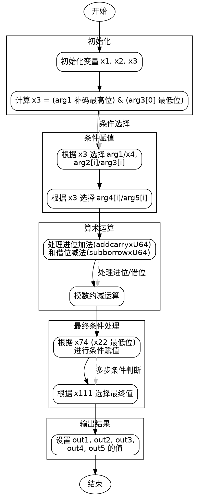

好的，我需要帮用户分析这个用Zig编写的函数，并生成对应的流程图。首先，我得理解这个函数的功能和结构。看起来这是一个处理椭圆曲线加密的函数，特别是针对P256曲线的64位实现。函数名为divstep，接受多个指针参数用于输出，还有一些输入参数，包括u64类型的arg1到arg5数组。

接下来，我需要逐步解析函数的逻辑。函数内部有很多变量和操作，比如addcarryxU64、cmovznzU64、subborrowxU64等，这些可能是处理大数运算的辅助函数，用于处理进位和条件赋值。函数开始时计算x1和x2，通过addcarryxU64操作，可能是在处理补码或者某种位运算。然后通过cmovznzU64根据条件选择不同的值，这可能是在实现某种条件分支逻辑。

中间部分有很多变量之间的运算，涉及到多个数组元素的操作，可能需要跟踪每个变量的变化，以及各个条件判断的结果。例如，x3是根据arg1和arg3[0]的最低位计算出来的条件值，后续的多个cmovznzU64调用都依赖于这个条件。此外，还有一系列的加法和减法操作，处理进位和借位，这可能是模数运算的一部分，用于处理椭圆曲线中的点运算或标量乘法。

在函数的最后部分，out1到out5被赋值，这些输出参数可能是计算结果的不同部分，比如坐标值、中间状态等。需要注意的是，流程图中需要体现这些条件分支、循环（如果有的话），以及各个操作之间的依赖关系。

考虑到函数中没有明显的循环结构，但有很多条件赋值和位操作，流程图应该由多个判断节点组成，每个条件判断后跟随相应的操作步骤。例如，首先判断x3的值，然后根据这个值选择不同的路径，处理不同的变量赋值。之后可能还有基于x48、x111等条件的进一步判断和赋值。

为了绘制流程图，需要将每个主要操作步骤和条件判断转化为图形元素。开始节点是函数入口，然后是初始化变量，接着是第一个条件判断（x3的计算），然后根据条件选择不同的路径处理变量。随后进行一系列的算术运算，处理进位和借位，最后根据最终条件设置输出参数。每个步骤之间用箭头连接，条件判断用菱形框表示，操作步骤用矩形框表示。

需要注意的是，由于函数较为复杂，变量众多，流程图可能会非常庞大。可能需要将某些重复的操作模式抽象成子流程，或者分块处理，以提高可读性。此外，注释每个步骤的作用，如“计算补码”、“条件赋值”、“处理进位加法”等，有助于理解流程。

总结来说，流程图的大致结构如下：
1. 函数入口，初始化变量。
2. 计算初始条件x3。
3. 根据x3选择不同的变量赋值路径。
4. 处理一系列的加法和减法操作，处理进位和借位。
5. 根据中间条件（如x48、x111）进行进一步的条件赋值。
6. 设置输出参数out1到out5。
7. 函数结束。

在绘制时，需要确保每个条件分支都有明确的路径，并且所有变量的赋值和操作步骤都正确反映在流程图中。可能还需要标注关键变量和操作的作用，以便读者理解每个步骤的目的。
================================================

### 流程图说明：
1. **初始化阶段**：计算初始条件 `x3`，决定后续的分支逻辑。
2. **条件赋值**：根据 `x3` 的值选择不同的输入参数（`arg1`/`arg4` 或补码值）。
3. **算术运算**：处理大数的加法和减法，包含进位和借位操作，并执行模数约减（如 P256 的素数域运算）。
4. **最终条件处理**：根据中间结果（如 `x74` 和 `x111`）进行最终的条件赋值。
5. **输出结果**：将计算结果写入 `out1` 到 `out5` 的指针参数中。

流程图使用 **Graphviz** 绘制，清晰地展示了函数的控制流和数据依赖关系。