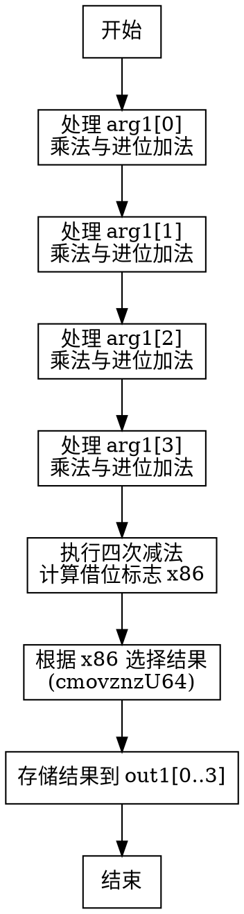

嗯，我现在需要为这个用 Zig 写的函数画一个流程图。这个函数的名字是 fromMontgomery，看起来像是将蒙哥马利域的元素转换到非蒙哥马利域。首先，我需要理解这个函数的逻辑，然后才能画出正确的流程图。

首先，函数参数是 out1 和 arg1，out1 是一个指向非蒙哥马利域元素的指针，arg1 是蒙哥马利域的元素。函数体里面有很多变量和操作，主要是进行乘法、加法、进位处理，还有一些条件移动指令。看起来像是在进行大数的运算，可能涉及到模约减或者类似的操作。

让我一步一步看代码。开始的时候，@setRuntimeSafety(mode == .Debug); 这是设置运行时安全检查，可能在调试模式下启用。接下来，取 arg1 的第一个元素 x1。然后有一系列的 mulxU64 调用，这可能是无符号64位乘法，输出两个结果，比如高位和低位。之后是 addcarryxU64，处理进位加法。

例如，首先处理 x1 乘以不同的常数，比如 0xffffffff00000001、0xffffffff、0xffffffffffffffff。这些常数可能和椭圆曲线 P-256 的模数有关。P-256 的素数域模数是 2^256 - 2^224 + 2^192 + 2^96 -1，可能分解成这些64位的常数。

接着，每一步处理似乎是在逐步计算各个部分，并处理进位。例如，在第一个部分，x10 = x1 + x6，然后处理进位。这可能是在做蒙哥马利约减的过程，将每个元素进行乘法并累加，最后减去模数，如果结果大于模数的话。

之后，每个步骤处理了不同的元素，比如 arg1[1], arg1[2], arg1[3]，依次进行类似的乘法、加法和进位处理。最后有一些 subborrowxU64 的操作，可能是进行减法并借位，然后根据借位的情况，使用 cmovznzU64 进行条件移动，选择正确的结果。

可能的流程是：对于输入的每个元素，进行一系列的乘法和累加操作，处理进位，然后进行模约减，最后根据条件判断是否减去模数，并将结果存储在 out1 中。

现在，要画流程图的话，应该从函数的入口开始，按步骤分解每个操作块。可能需要将每个大的操作块（比如处理每个arg1[i]的部分）作为不同的节点，并连接它们的流程。

可能的步骤：

1. 初始化部分：获取arg1[0]，开始计算。
2. 处理第一个元素（arg1[0]）的乘法和加法，处理进位。
3. 处理第二个元素（arg1[1]），同样进行乘法和加法，处理进位，并与之前的结果结合。
4. 处理第三个元素（arg1[2]），同样步骤。
5. 处理第四个元素（arg1[3]），同样步骤。
6. 最后的模约减步骤，通过减法判断是否溢出，并条件移动结果到输出。
7. 将结果存储到out1数组的各个位置。

每个步骤中，可能涉及多个乘法和进位加法，这些可以作为子步骤。但由于流程图需要简洁，可能将每个主要阶段作为一个节点，比如“处理第一个元素”，“处理第二个元素”等。

另外，最后的条件判断部分（subborrowxU64和cmovznzU64）可能需要分支，根据借位情况选择不同的值。所以在流程图中，可能需要一个判断节点，根据是否有借位，选择不同的路径。

不过，这个函数中的所有条件移动都是基于最后一个借位标志x86，所以可能只有一个条件判断，决定是否使用减法后的结果还是原来的值。

综上，流程图的大致结构可能是：

开始 -> 处理arg1[0] -> 处理arg1[1] -> 处理arg1[2] -> 处理arg1[3] -> 执行四次减法并检查借位 -> 根据最终借位选择结果 -> 存储到out1 -> 结束。

每个处理步骤内部可能包含多个乘法和进位加法操作，但在流程图中可能需要简化为一个处理块，比如“处理元素i的乘法与加法”。

此外，最后的减法操作和条件移动部分需要详细展示，因为这是确定最终结果的关键步骤。

现在需要将这些步骤转化为Graphviz的节点和边。使用digraph，节点用方框，判断用菱形，操作用矩形。

可能的节点：

- 开始
- 处理arg1[0]的乘法和加法
- 处理arg1[1]的乘法和加法
- 处理arg1[2]的乘法和加法
- 处理arg1[3]的乘法和加法
- 执行四次减法并检查借位
- 条件判断（是否有借位）
- 选择结果（x86是否为0）
- 存储结果到out1
- 结束

边的话，按照执行顺序连接这些节点。在条件判断处，会有两个分支：借位存在或不存在，然后选择对应的结果。

不过，根据代码，最后的四个subborrowxU64是链式进行的，每个步骤的借位会影响下一个。然后根据最终的x86（即最后一次subborrow的借位）来决定是否使用减法后的值还是原来的值。因此，条件判断是基于x86是否为0，如果是，则需要使用减法后的结果，否则保持原值。

所以，流程图中，在执行完四次减法后，得到x86的值，然后根据这个值，使用cmovznzU64来更新每个结果值x87到x90，最后存入out1。

因此，流程图的结构大致如下：

开始 → 处理每个arg1元素 → 计算四个减法 → 判断是否有借位 → 选择结果 → 存储结果 → 结束。

现在需要将这些步骤用Graphviz的语法表示出来。每个主要步骤作为节点，箭头表示流程方向。条件判断节点有两个分支，但在这个函数中，所有四个结果的选择都是基于同一个x86的值，所以可能只需要一个条件判断节点，分支到两种情况，然后合并到存储结果。

现在，开始编写Graphviz代码：

digraph fromMontgomeryFlow {
    node [shape=rectangle];
    start [label="开始"];
    process_arg1_0 [label="处理arg1[0]的乘法和加法"];
    process_arg1_1 [label="处理arg1[1]的乘法和加法"];
    process_arg1_2 [label="处理arg1[2]的乘法和加法"];
    process_arg1_3 [label="处理arg1[3]的乘法和加法"];
    compute_subtractions [label="执行四次减法并计算借位"];
    check_borrow [label="检查最终借位x86", shape=diamond];
    select_results [label="根据x86选择结果（cmovznzU64）"];
    store_results [label="存储结果到out1"];
    end [label="结束"];

    start -> process_arg1_0;
    process_arg1_0 -> process_arg1_1;
    process_arg1_1 -> process_arg1_2;
    process_arg1_2 -> process_arg1_3;
    process_arg1_3 -> compute_subtractions;
    compute_subtractions -> check_borrow;
    check_borrow -> select_results [label="x86 != 0"];
    check_borrow -> store_results [label="x86 == 0"];
    select_results -> store_results;
    store_results -> end;
}

不过，这里可能存在问题，因为在代码中，无论x86是否为0，都会执行cmovznzU64，所以无论借位是否存在，都需要选择结果。因此，可能条件判断后的两个路径都需要执行选择结果的步骤，或者更准确地说，select_results 节点总是被执行，而cmovznzU64会根据x86的值选择是否替换原来的值。因此，可能不需要分支，而是直接进行条件移动，然后存储结果。

可能调整后的流程是：计算四次减法得到可能的x77-x83等值，然后不管有没有借位，都使用cmovznzU64来选择结果，然后存储。因此，check_borrow节点可能不需要分两个分支，而是直接进入选择结果的步骤，该步骤内部处理条件。

因此，流程图可能不需要条件分支，而是直接执行选择结果的操作，无论借位如何。或者，条件移动指令本身在流程图中可能不需要分支，因为它们是根据条件选择值，而不是改变流程方向。

所以，可能更准确的流程是：

开始 → 处理每个元素 → 计算四次减法 → 根据最终借位选择结果 → 存储 → 结束。

因此，Graphviz代码可以简化为：

digraph fromMontgomeryFlow {
    node [shape=rectangle];
    start [label="开始"];
    process_arg1_0 [label="处理arg1[0]的乘法和加法"];
    process_arg1_1 [label="处理arg1[1]的乘法和加法"];
    process_arg1_2 [label="处理arg1[2]的乘法和加法"];
    process_arg1_3 [label="处理arg1[3]的乘法和加法"];
    compute_subtractions [label="执行四次减法并计算借位x86"];
    select_results [label="根据x86选择结果（cmovznzU64）"];
    store_results [label="存储结果到out1"];
    end [label="结束"];

    start -> process_arg1_0;
    process_arg1_0 -> process_arg1_1;
    process_arg1_1 -> process_arg1_2;
    process_arg1_2 -> process_arg1_3;
    process_arg1_3 -> compute_subtractions;
    compute_subtractions -> select_results;
    select_results -> store_results;
    store_results -> end;
}

这样可能更准确，因为无论借位如何，都需要执行选择结果的步骤，而cmovznzU64内部根据条件选择值，但流程上并不分支，只是数据的选择。

这样，流程图就展示了主要的处理步骤，没有显式的条件分支，而是将条件移动作为数据处理的一部分。

可能还需要更详细地分解每个处理arg1[i]的步骤，但为了简洁，可能将它们合并为一个处理块，每个块处理一个数组元素。

总结，这个流程图应该反映函数的主要步骤：依次处理四个输入元素，进行乘法和进位加法，然后执行四次减法计算可能的模约减，最后根据借位选择结果并存储。
================================================
