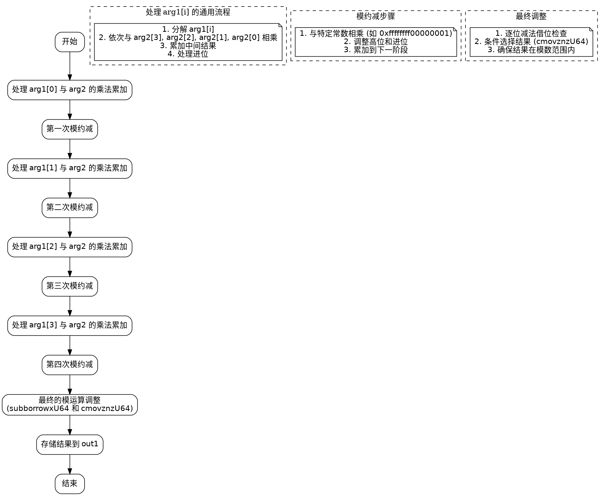

嗯，我现在需要为这个用Zig写的函数绘制一个流程图。首先，我得理解这个函数是做什么的。看起来这是一个在Montgomery域中进行乘法运算的函数，特别是针对P-256曲线优化的。函数名为mul，接受三个参数：out1是一个指向MontgomeryDomainFieldElement的指针，arg1和arg2是MontgomeryDomainFieldElement类型的参数。函数的主要目的是将arg1和arg2相乘，结果存储在out1中。

首先，我需要理清函数的整体结构。函数开始时定义了一些变量，然后进行一系列的乘法和加法操作，可能涉及到大数运算，因为使用了mulxU64和addcarryxU64这样的函数。这些函数通常用于处理64位无符号整数的乘法和带进位的加法，尤其是在加密算法中处理大数运算时常见。

接下来，函数中有多个部分，每个部分可能对应不同的乘法步骤。例如，第一个部分处理arg1[0]与arg2的各个元素相乘，然后进行累加。之后，类似的步骤重复处理arg1[1]、arg1[2]、arg1[3]与arg2的各个元素相乘，并进行累加。每次处理完一个元素后，都会进行模约减（可能使用Montgomery约减），通过乘以特定的常数（如0xffffffff00000001等）并进行调整。

在代码的最后部分，有subborrowxU64和cmovznzU64函数的调用，这可能是进行最终的模运算，确保结果在正确的范围内，即当结果超过模数时减去模数，否则保持不变。最终结果被存储到out1数组中。

为了绘制流程图，我需要将这些步骤分解成不同的块。可能的步骤如下：

1. 初始化变量和分解输入参数。
2. 对arg1的每个元素（x4, x1, x2, x3）分别处理，与arg2的各个元素相乘，并进行累加。
3. 每次处理完一个arg1的元素后，进行模约减操作。
4. 最后进行最终的模运算调整，确保结果正确。
5. 将结果存储到out1中。

每个主要步骤可以表示为流程图中的一个节点。例如，处理arg1[0]的部分包括多次mulxU64和addcarryxU64的调用，接着是模约减。同样的流程重复处理arg1的其他元素。然后，最后的调整步骤包括subborrowxU64和条件移动操作。

需要注意的是，流程图中需要表现出循环或重复的结构，但由于代码是展开的（没有显式循环），每个处理步骤都是独立的块。因此，流程图会有多个并行的处理块，每个块对应arg1的一个元素。

此外，模约减的部分可能涉及特定的乘法和加法步骤，使用预定义的常数，如0xffffffff00000001，这些常数可能与P-256曲线的模数有关。因此，在流程图中需要明确这些步骤。

最后，条件移动操作（cmovznzU64）根据前面的借位情况选择是否使用减法后的结果，这需要在流程图中表示条件判断。

可能的流程节点如下：

- 开始
- 处理arg1[0]与arg2的乘法累加
- 第一次模约减
- 处理arg1[1]与arg2的乘法累加
- 第二次模约减
- 处理arg1[2]与arg2的乘法累加
- 第三次模约减
- 处理arg1[3]与arg2的乘法累加
- 第四次模约减
- 最终的模运算调整
- 存储结果到out1
- 结束

每个处理步骤内部可能包含多个乘法和加法操作，但为了简化流程图，可以将每个步骤作为一个整体块。模约减步骤也作为一个块，内部的详细操作可以合并表示。

对于条件判断部分（如最后的subborrowxU64和cmovznzU64），需要根据借位标志决定是否调整结果，因此在流程图中应有条件分支。

总结起来，流程图的大致结构是顺序处理每个arg1的元素，每次处理后进行模约减，最后进行最终的调整，并根据条件选择结果。
================================================
