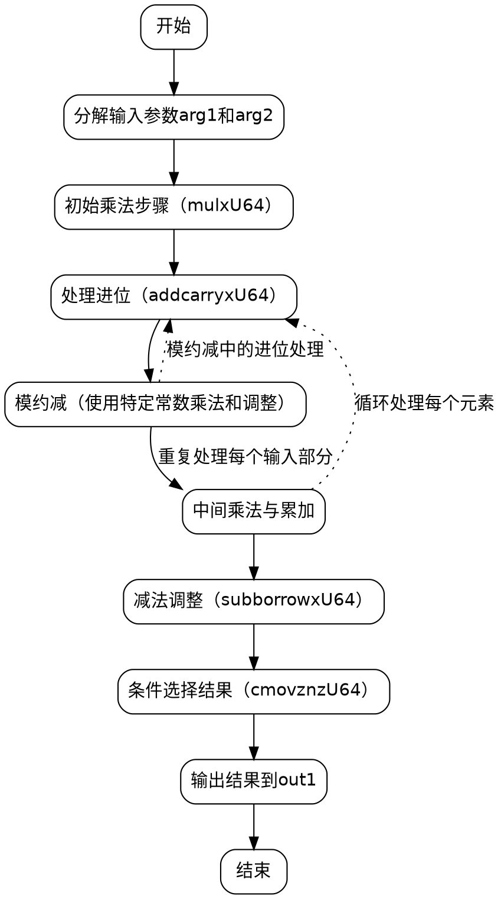

嗯，我现在需要为一个用Zig编写的函数绘制流程图。这个函数是用于椭圆曲线P-256的乘法运算，看起来涉及大量的位操作和算术运算。首先，我需要理解这个函数的整体结构和工作流程。

首先，函数名为mul，接受三个参数：输出out1，以及两个输入arg1和arg2，都是MontgomeryDomainFieldElement类型。看起来这是在做Montgomery域中的乘法运算，可能涉及模约减。

接下来，函数内部有很多变量定义和操作。例如，arg1被分解为x1, x2, x3, x4，然后通过mulxU64进行无符号乘法，并处理进位。然后使用addcarryxU64处理进位加法。之后还有一些乘法和加法操作，可能是在进行大数乘法的中间步骤。

然后，看到一些常量，比如0xffffffff00000001，这可能是P-256曲线的模数相关参数。每次处理完一部分乘法后，会进行一些模约减的步骤，可能通过乘法和减法来调整结果，使其保持在模数范围内。

在代码的后半部分，使用了subborrowxU64来处理减法借位，这可能是在最后的模约减步骤中，将结果调整到正确的范围内。最后使用cmovznzU64根据条件选择值，确保结果正确。

现在，我需要将这些步骤转化为流程图。流程图应该包括主要的操作步骤，如初始分解参数、乘法、进位处理、模约减、条件选择等。

可能的步骤分解：

1. 分解输入参数arg1和arg2的各个部分。
2. 进行多精度乘法，逐部分相乘并累加进位。
3. 中间结果的模约减处理，使用特定的常数进行乘法和调整。
4. 处理每一步的进位和借位。
5. 最后的减法调整，确保结果在模数范围内。
6. 条件移动（cmovznzU64）选择正确的值作为输出。

需要注意循环结构，但代码中没有明显的循环，而是展开的操作。因此，流程图可能是一系列顺序的操作块，每个块处理特定的乘法、加法、进位和模约减步骤。

每个主要的乘法步骤（如mulxU64）后跟处理进位（addcarryxU64）可能形成一个块。然后，模约减步骤可能涉及多次乘法和减法，同样需要处理进位和借位。

最后的条件判断和结果选择也是关键步骤，需要体现在流程图中。

可能需要将整个过程分为几个阶段：乘法阶段、中间约减阶段、累加阶段、最后的约减阶段和结果输出阶段。每个阶段内部包含具体的操作步骤，如乘法、加法、处理进位、减法、处理借位等。

绘制时，需要将这些步骤按顺序连接，条件判断分支（如subborrowxU64的结果影响后面的cmovznzU64）需要用箭头表示不同的路径。

总之，流程图应反映函数中的数据处理流程，包括各个乘法、加法、进位处理、模约减步骤，以及最后的条件选择和输出。
================================================
