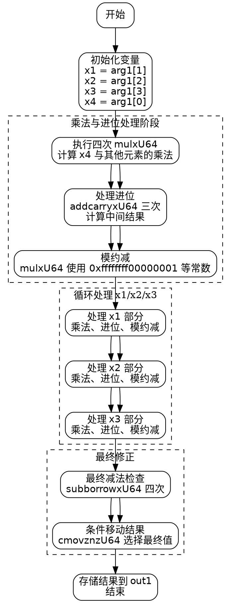

好的，我需要为提供的Zig函数绘制流程图。首先，我需要理解这个函数的功能。看起来这是一个在椭圆曲线P-256上执行平方运算的函数，使用了Montgomery域的元素。函数名为square，接受两个参数：out1（输出）和arg1（输入），都是MontgomeryDomainFieldElement类型。

接下来，我需要逐行分析代码。函数开始时设置运行时安全检查，然后定义了一些变量x1到x4，分别对应arg1的不同元素。之后，使用mulxU64进行无符号乘法，并将结果存储在变量中。这里多次使用mulxU64和addcarryxU64，这些可能是内联汇编或特定的函数，用于处理大数的乘法和带进位的加法。

随后，代码中多次出现类似的模式：乘法、加法、进位处理，接着进行模约减（使用0xffffffff00000001等常数）。每个阶段处理不同的输入部分（x1, x2, x3），然后进行进位和模运算。最后，通过条件移动指令cmovznzU64来处理可能的减法借位，确保结果在正确的范围内。

为了绘制流程图，我需要将这些步骤分解为基本块，并确定它们之间的控制流。虽然代码中没有明显的循环或条件分支（除了最后的条件移动），但每一步的进位和借位处理可能引入不同的路径。不过，由于所有操作都是顺序执行，并且最后的条件移动仅根据借位标志选择值，流程图可能主要由顺序的操作节点组成，末尾有几个条件判断节点。

可能的步骤包括：

1. 初始化变量并加载输入元素。
2. 执行一系列的乘法和累加操作，处理进位。
3. 进行模约减，使用特定的常数。
4. 处理不同部分的输入（如x1, x2, x3），重复类似的乘法和模运算步骤。
5. 最后的减法检查，处理可能的借位，使用条件移动选择最终结果。

需要注意每个阶段的依赖关系，例如每一步的输出作为下一步的输入。此外，进位和借位标志会影响后续的操作，需要在流程图中体现这些条件路径。

最后，使用Graphviz的DOT语言将各个步骤表示为节点，用箭头连接表示控制流。可能需要将重复的结构简化为一个通用块，并在每个阶段标注操作类型（如乘法、加法、模约减等），以及条件处理部分。
================================================
