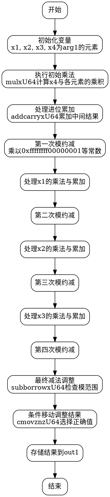

好的，我需要为给定的Zig函数绘制一个流程图。首先，我得仔细阅读代码，理解它的结构和各个部分的功能。这个函数名为square，接受两个参数：out1和arg1，都是MontgomeryDomainFieldElement类型。看起来这个函数在计算某个值的平方，可能是在椭圆曲线加密中的P-256曲线上进行的操作。

首先，函数内部有很多变量定义和数学运算，比如mulxU64（乘法）、addcarryxU64（带进位的加法）、subborrowxU64（带借位的减法）以及cmovznzU64（条件移动）。这些操作通常用于大数运算，处理64位无符号整数的乘法和模约减。

接下来，我需要理清函数的流程。代码分为多个部分，每个部分似乎对应不同的乘法步骤和模约减。例如，初始部分处理arg1的各个元素相乘，并累加中间结果，然后进行模运算。之后可能有多个阶段，处理不同的变量组合，最后进行条件移动以确定最终的输出值。

为了绘制流程图，我需要将代码分解为基本块，每个块代表一个主要的操作步骤。可能的步骤包括：

1. 初始化变量并执行初始乘法。
2. 处理进位和中间结果的累加。
3. 执行模运算（乘以特定常数，如0xffffffff00000001）。
4. 重复上述步骤，处理不同的输入部分（x1, x2, x3等）。
5. 最后的减法步骤，检查是否需要调整结果以符合模数的范围。
6. 使用条件移动指令选择正确的结果，存储到out1中。

需要注意每个步骤之间的依赖关系，比如前一步的输出作为下一步的输入。同时，循环结构可能不明显，但可能存在重复的模式，比如多次执行乘法和进位处理。

可能的挑战在于处理大量的变量和中间步骤，确保每个操作的顺序和依赖关系正确无误地反映在流程图中。此外，模运算的细节需要准确表示，以避免错误。

最后，将所有这些步骤用graphviz的节点和边连接起来，形成清晰的流程图。每个节点代表一个操作或判断，边表示控制流。需要确保流程图的逻辑与代码完全一致，没有遗漏关键步骤。
================================================
