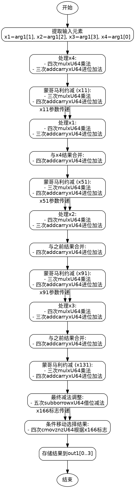

好，我现在需要为这个用Zig编写的函数画一个流程图。首先，我得仔细看看这个函数是做什么的。函数名是toMontgomery，看起来是将一个非蒙哥马利域的元素转换为蒙哥马利域的元素。这通常用于椭圆曲线加密中的高效计算，比如P-256曲线。

首先，我需要理解函数的整体结构。函数接收一个输出参数out1和一个输入参数arg1。里面有很多变量定义和数学运算，尤其是mulxU64（可能是乘法）、addcarryxU64（带进位的加法）、subborrowxU64（带借位的减法）以及cmovznzU64（条件移动）等操作。这些操作可能涉及到大数的运算，因为P-256处理的是256位的数，分成4个64位块。

接下来，我需要逐行分析代码，理清各个步骤之间的流程。函数开始的时候，先提取了输入参数arg1的各个部分x1到x4，然后进行一系列的乘法和累加操作。每个乘法步骤后都跟着进位处理，可能是在进行大数的模乘运算。接着，处理了x1、x2、x3的部分，每个部分都有类似的乘法、进位加法和模约减步骤。最后，有一系列的subborrowxU64和cmovznzU64操作，可能是在进行模运算后的调整，确保结果在正确的范围内。

为了画出流程图，我需要确定各个步骤之间的逻辑关系。函数的结构可能分为几个主要部分：初始化、处理每个输入元素（x4, x1, x2, x3）、模运算以及最终的条件选择存储结果。每个处理阶段可能包含乘法、累加、进位处理，然后进行模约减。最后的条件移动操作是根据减法后的借位情况来决定是否使用调整后的值。

需要注意的是，每个变量的使用和依赖关系，比如x5到x12是x4的乘法结果，之后与x13到x20的加法进位处理相关联。然后针对每个输入元素x1、x2、x3重复类似的结构。最后的部分是模约减后的调整，通过减法判断是否需要调整结果，并利用条件移动来选择正确的值。

可能存在的分支是在最后的减法部分，根据借位标志来决定是否替换结果。因此，流程图会有条件判断的分支，根据x166（借位标志）来决定输出哪个值。

在绘制流程图时，应使用graphviz的语法，用矩形框表示操作步骤，菱形框表示条件判断，箭头连接各个步骤。每个处理块可能包含多个步骤，比如乘法、进位处理、累加等，可以适当合并或分开展示，以保持流程图的清晰。

需要确保流程图的逻辑顺序正确，每个步骤之间的数据流和控制流都正确表示。特别是进位和借位的处理，可能会影响后续的运算路径。此外，条件移动操作需要根据前面的借位结果来选择不同的路径。

最后，检查是否有遗漏的步骤或者错误的连接，确保流程图准确反映代码的执行流程。
================================================
