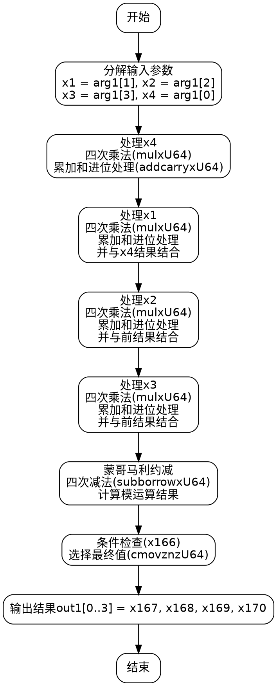

好的，我现在需要为这个Zig函数绘制一个流程图。首先，我需要理解这个函数的功能。看起来这是一个椭圆曲线密码学中的转换函数，将非蒙哥马利域的元素转换为蒙哥马利域。函数名是toMontgomery，参数是一个输出数组out1和一个输入数组arg1。

接下来，我需要仔细阅读代码，理清它的执行流程。代码中有很多变量和操作，比如mulxU64（可能是乘法）、addcarryxU64（带进位的加法）、subborrowxU64（带借位的减法），以及条件移动指令cmovznzU64。这些操作通常用于大数运算，处理64位无符号整数的乘法和模运算。

首先，函数开始部分解构了输入参数arg1，将各个元素赋值给x1到x4。然后进行一系列的乘法和加法操作，生成中间变量x5到x170。这些步骤可能是在执行蒙哥马利约减或转换过程中的乘法、累加和模约减步骤。

我需要将这些步骤分解成基本块，并识别其中的控制流。例如，可能存在循环结构或条件分支。不过，从代码中看，大部分是顺序执行的操作，只有最后的条件移动指令cmovznzU64会根据前面的减法结果选择不同的值，这可能导致分支。

可能的流程如下：

1. 初始化：分解输入参数。
2. 处理x4：进行四次乘法，然后一系列的加法和进位处理。
3. 处理x1：类似的乘法、加法和进位处理，并与之前的结果结合。
4. 处理x2：重复类似步骤。
5. 处理x3：同样步骤。
6. 最后的模约减：通过subborrowxU64进行减法，然后根据条件选择结果。
7. 将结果赋值给out1。

需要注意的是，每个处理步骤（x4、x1、x2、x3）可能结构相似，可以视为循环展开的四个迭代。但由于代码是展开的，流程图中可能需要分别表示每个步骤。

在绘制流程图时，应使用不同的节点表示不同的操作：开始、结束、处理步骤、条件判断等。每个乘法、加法和进位处理可以视为一个处理节点，最后的条件移动作为条件分支节点。

最后，需要验证是否存在循环或复杂的分支结构。从代码来看，主要的分支在最后的条件移动，根据x166的值选择不同的结果。因此，流程图可能是一个线性的处理流程，末尾有一个条件判断来选择结果。
================================================
