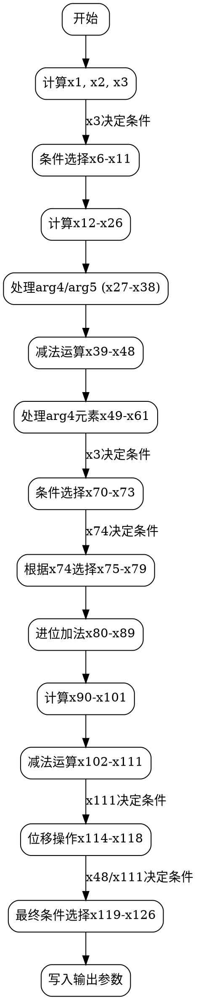

好的，我现在需要帮助用户将给定的Zig函数转换为流程图，使用Graphviz。首先，我需要理解这个函数的结构和逻辑。这个函数名为`divstep`，参数包括多个输出指针和输入参数。看起来像是处理某种密码学相关的运算，可能与椭圆曲线有关，因为文件名提到了p256曲线。

首先，我会通读代码，了解大致的流程。函数内部有很多变量操作，比如addcarryxU64、cmovznzU64等，这些可能是处理64位无符号整数的进位和条件移动操作。代码中大量的位运算和条件判断，可能是在实现某种算法步骤，比如模逆运算或者除法步骤。

接下来，我需要确定函数的主要步骤和分支。函数开始时计算x1和x2，然后根据x3进行条件判断，之后有一系列的cmovznzU64调用，这些可能是根据条件选择不同的值。中间涉及到多次进位加减运算，比如addcarryxU64和subborrowxU64，处理大整数的运算。然后有一些位移操作，比如右移和左移组合，可能是调整数值的位布局。最后，将结果赋值给各个输出参数。

为了绘制流程图，我需要将函数的控制流分解成基本块，每个块代表一个连续的操作序列，没有分支或跳转。然后确定这些块之间的连接关系，包括条件分支。例如，x3和x48等变量可能影响条件移动指令，从而改变执行路径。

可能的步骤分解：

1. 初始计算：计算x1, x2, x3, x4, x5等。
2. 条件选择：根据x3的值，选择不同的参数值赋给x6到x11。
3. 更多的进位加减运算，生成x12到x26。
4. 处理arg4和arg5，生成x27到x30，并进行进位加减运算得到x31到x38。
5. 减法运算生成x39到x48，可能涉及模运算。
6. 处理arg4的各个元素，生成x49到x52，再进行减法运算得到x53到x61。
7. 条件选择x70到x73，基于x3的值。
8. 根据x74（x22的最低位）进行条件选择，生成x75到x79。
9. 执行进位加法生成x80到x89。
10. 处理x90到x93，再进行进位加法生成x94到x101。
11. 减法运算生成x102到x111。
12. 计算x112到x118，涉及位移操作。
13. 最后根据条件选择x119到x126，并将结果写入输出参数。

每个步骤可能对应流程图中的一个节点。条件判断（如cmovznzU64）会产生分支，但可能因为是基于数据的条件移动，而非控制流的分支，所以可能不需要显式的条件节点，而是通过不同的变量赋值表示不同的路径。

需要注意，由于函数中没有显式的循环或条件语句（如if/else），所有的条件操作都是通过cmovznzU64等内联函数处理的，因此流程图的结构可能是线性的，但带有条件数据选择的分支。不过，从控制流的角度来看，代码是顺序执行的，没有跳转，因此流程图可能主要由顺序的操作块组成，每个块内部处理不同的计算步骤，并根据条件选择不同的值。

因此，流程图可能由多个顺序的步骤组成，每个步骤处理特定的计算，并可能根据条件选择不同的数据路径。例如，初始条件x3影响后续变量的赋值，之后x48和x111也会影响后面的条件赋值。

最后，将所有这些步骤用Graphviz的节点和边表示出来，节点代表操作步骤，边代表控制流顺序。由于代码中没有循环，边应该是单向的，从上到下执行。可能需要将每个主要的计算阶段作为一个节点，并在节点内部描述进行的操作，如“计算x1, x2, x3”，“条件选择x6到x11”等。

总结来说，流程图将按照代码的执行顺序，逐步展示每个计算阶段，并在条件选择的地方标注条件的影响，但不会出现传统的分支结构，因为所有条件处理都是通过数据选择完成的。
================================================
要使用Graphviz绘制该函数的流程图，可以按照代码的执行顺序将主要步骤分解为节点，并用箭头表示控制流。以下是使用DOT语言的Graphviz流程图表示：

### 说明：
1. **节点**表示代码中的关键步骤：
   - 初始化计算（如`x1, x2`）
   - 条件选择（如`cmovznzU64`）
   - 算术运算（如`addcarryxU64`和`subborrowxU64`）
   - 位移操作（如`x114 = (x80 >> 1) | ...`）
   - 最终结果输出。

2. **边**表示执行顺序，箭头上的标签标注了影响流程的条件变量（如`x3`或`x74`）。

3. **特点**：
   - 流程是线性的，无显式循环。
   - 条件分支通过数据选择（如`cmovznzU64`）实现，因此图中用条件标签标注数据依赖。
   - 关键常量（如`0xf3b9cac2fc632551`）未展开，保留为计算步骤的一部分。

将此DOT代码保存为`.gv`文件后，使用Graphviz工具（如`dot -Tpng graph.gv -o graph.png`）可生成流程图。