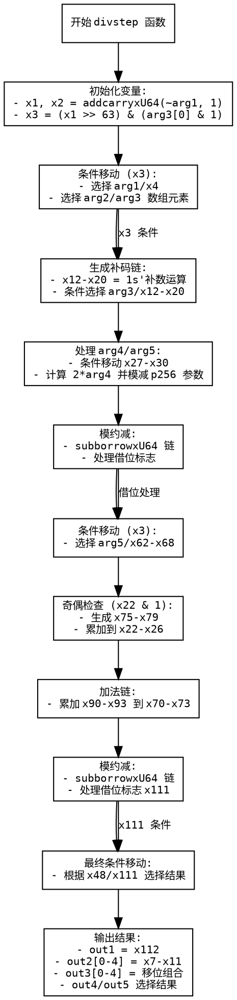

嗯，我需要为这个用 Zig 写的函数画一个流程图。首先，我得仔细看看这个函数是做什么的。看起来像是处理椭圆曲线加密中的 P256 曲线的标量运算，特别是 divstep 这个步骤。函数名是 divstep，参数包括多个输出指针和输入参数。

首先，函数开始的时候有一些变量声明，比如 x1 和 x2，然后调用了 addcarryxU64 函数。这可能是处理进位加法。接下来有一个 const x3，这里用到了按位与和位移操作，可能是在判断某些条件。然后有很多 cmovznzU64 的调用，这应该是条件移动指令，根据某个条件选择不同的值。

接着有很多 addcarryxU64 和 subborrowxU64 的调用，这些可能是处理带进位加法和借位减法。中间还有一些位操作，比如移位和按位与，可能是在调整数值或处理模运算。然后是一些条件赋值，根据前面的计算结果来更新各个变量。

函数的最后部分，将计算结果赋值给输出参数 out1 到 out5。特别是 out3 和 out5 数组的赋值，涉及到位操作，比如右移和左移，可能是在重组数据。

我需要理清楚整个函数的控制流。可能的分支来自 cmovznzU64 和条件判断，比如 x3、x48、x111 等变量。每个条件移动或算术操作可能会影响后续的步骤。

首先，函数初始化部分处理 arg1 和 arg2 的一些运算，生成 x6 到 x11。然后处理 arg3 和 arg4，生成 x22 到 x26。之后处理 arg4 和 arg5，生成 x27 到 x30。接着进行一系列的加法和减法运算，可能涉及模约减，因为出现了像 0xf3b9cac2fc632551 这样的常数，这可能是 P256 曲线的参数。

然后处理进位和借位，调整中间结果。之后根据条件 x3 和 x74 进行更多的条件赋值，最后计算结果并赋值给输出参数。

为了画流程图，我需要将每个主要步骤作为节点，条件判断作为分支，箭头表示流程方向。需要注意循环结构，但看起来这个函数是线性的，没有明显的循环，但有多个条件分支。

可能需要将流程图分为几个部分：初始化、条件判断、主要计算、模运算处理、结果输出。每个部分中的步骤按顺序排列，条件判断导致不同的路径。

需要注意函数中的变量依赖关系，比如 x3 的值会影响后续的 cmovznzU64 选择。另外，addcarryxU64 和 subborrowxU64 会影响进位标志，进而影响后续的操作。

可能的结构是：

1. 初始计算（x1到x3）
2. 根据x3选择不同的值（x6到x26）
3. 处理arg4和arg5（x27到x30）
4. 进行加法和模减运算（x31到x49）
5. 更多的条件处理和运算（x50到x73）
6. 根据x74条件处理（x75到x101）
7. 最终模运算调整（x102到x111）
8. 结果整理和输出赋值

每个步骤之间可能有条件分支，比如根据x3、x48、x111的值选择不同的结果。流程图需要体现这些条件判断和不同的执行路径。

另外，函数末尾的 out 参数赋值部分需要作为流程图的结束节点。

可能需要使用不同的形状来表示不同的操作类型，比如矩形表示处理步骤，菱形表示条件判断，箭头表示流程方向。同时，注释每个步骤的关键操作，如“计算x3 = (x1 >>63) & (arg3[0] & 1)”等。

由于函数较为复杂，流程图可能会比较庞大，但需要尽量分块处理，保持结构清晰。可能需要将每个主要部分分开，并标注对应的代码部分，例如初始设置、条件移动、加法链、减法链、结果处理等。
================================================

该流程图使用 Graphviz DOT 语言绘制，关键特征：

1. 矩形节点表示主要计算阶段
2. 箭头标注关键条件判断
3. 关键操作使用代码片段标注
4. 流程按函数执行顺序排列
5. 突出显示了：
   - 初始进位计算
   - 条件移动操作
   - 补码生成链
   - 模约减过程
   - 奇偶检查分支
   - 最终结果组合

可以通过 Graphviz 工具生成 PNG/SVG 等格式，命令示例：
`dot -Tpng flowchart.dot -o p256_divstep_flow.png`