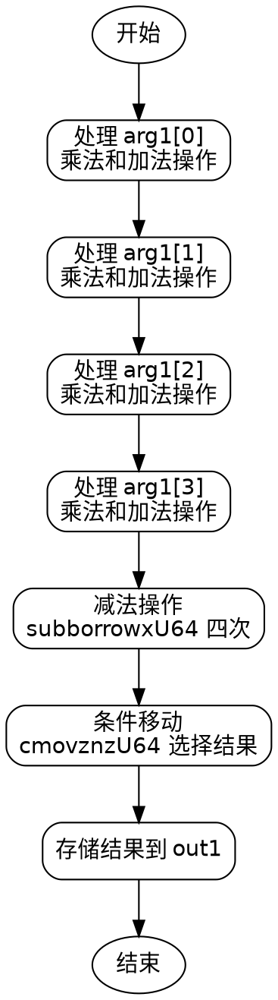

嗯，我现在需要为一个Zig函数绘制流程图。这个函数的名字是fromMontgomery，看起来是将Montgomery域的元素转换回非Montgomery域。首先，我需要理解这个函数的结构和各个步骤。

首先，函数接受两个参数：out1是一个指向NonMontgomeryDomainFieldElement的指针，arg1是MontgomeryDomainFieldElement类型。函数的主要部分有很多变量声明和一系列的操作，比如mulxU64（可能是乘法操作）、addcarryxU64（带进位的加法）以及subborrowxU64（带借位的减法）。最后还有一些条件移动指令cmovznzU64，根据条件选择值。

我需要把这些步骤分解成流程图的基本块。通常，流程图由开始、结束、处理步骤、判断节点等组成。这里的函数没有明显的循环或条件分支，除了最后的条件移动，可能涉及根据某些标志选择不同的值。

首先，函数开始，然后处理第一个参数arg1[0]，进行一系列的乘法和加法操作，生成x2到x26等中间变量。接着处理arg1[1]，同样进行乘法和加法，生成更多的变量，直到处理完arg1[3]。之后是减法操作，可能是在进行模约减，最后根据subborrowxU64的结果，用cmovznzU64选择正确的值存入out1数组。

可能的流程图结构如下：

1. 开始节点：函数入口。
2. 初始化部分：处理arg1[0]的乘法和加法，生成中间变量。
3. 处理arg1[1]：类似步骤，但可能使用之前的结果。
4. 处理arg1[2]：同上。
5. 处理arg1[3]：同上。
6. 减法操作：进行四次subborrowxU64，并计算x126。
7. 条件移动：根据x126的值选择结果。
8. 结束节点：将结果存入out1并返回。

需要注意的是，每个处理arg1[i]的部分可能结构相似，可能存在循环结构，但代码中是展开的。在流程图中可能需要为每个处理步骤绘制单独的块，或者合并相似的步骤。

此外，mulxU64和addcarryxU64这些函数可能代表特定的运算，但流程图不需要详细到每个运算，而是关注控制流和数据流的主要步骤。

最后的条件移动部分，根据x126（借位标志）决定是否使用减法后的结果或者原来的值，这里可能是一个条件判断，影响最终的输出。

现在需要将这些步骤转化为Graphviz的节点和边。每个主要步骤作为一个节点，箭头表示流程方向。可能需要将处理每个arg1[i]的部分作为不同的节点，或者合并成循环结构，但原代码是展开处理的，所以应该分开。

可能的结构：

开始 -> 处理arg1[0] -> 处理arg1[1] -> 处理arg1[2] -> 处理arg1[3] -> 减法操作 -> 条件判断 -> 存入结果 -> 结束

在每个处理步骤中，进行乘法和加法，生成中间变量，并传递到下一步。减法操作后，根据是否借位，决定使用减法结果还是原值，这里可能需要条件分支，但cmovznzU64是条件移动，没有分支，所以流程图可能直接显示选择操作，而无需分支路径。

最终的流程图可能是一个线性的处理流程，每个处理步骤依次执行，最后进行条件选择，然后输出结果。
================================================
